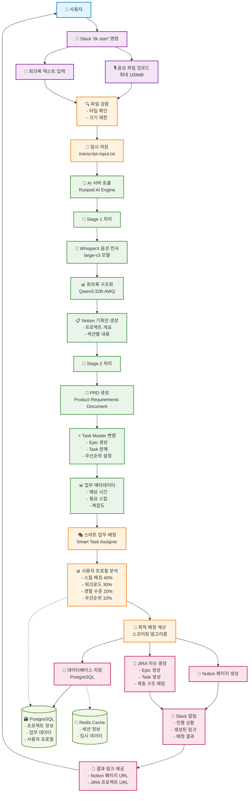

# TtalKkak 데이터 플로우 다이어그램

## 개요
TtalKkak 시스템의 핵심 워크플로우인 "음성 입력 → AI 처리 → 자동 업무 생성" 과정의 데이터 흐름을 보여줍니다.

## Mermaid 다이어그램



## 상세 데이터 흐름 설명

### 1. 입력 단계
- **음성 파일**: WAV, MP3 등 (최대 100MB)
- **텍스트 입력**: 직접 회의록 입력 가능
- **파일 검증**: 타입, 크기, 보안 검사

### 2. AI 처리 파이프라인
#### Stage 1: 음성 → 기획안
```json
{
  "transcript": "전사된 텍스트",
  "notion_project": {
    "title": "프로젝트명",
    "overview": "개요",
    "sections": [
      {
        "title": "섹션명",
        "content": "상세 내용"
      }
    ]
  }
}
```

#### Stage 2: 기획안 → 업무
```json
{
  "task_master_prd": {
    "title": "시스템 개발",
    "tasks": [
      {
        "title": "업무명",
        "description": "업무 설명",
        "priority": "HIGH|MEDIUM|LOW",
        "estimated_hours": 40,
        "complexity": "HIGH|MEDIUM|LOW",
        "subtasks": [...]
      }
    ]
  }
}
```

### 3. 스마트 배정 알고리즘
```typescript
// 스코어링 공식
totalScore = (skillScore * 0.4) + 
            (workloadScore * 0.3) + 
            (experienceScore * 0.2) + 
            (priorityScore * 0.1)
```

### 4. 외부 연동 데이터
- **Notion API**: 페이지 생성, 블록 구조화
- **JIRA API**: 이슈 생성, Epic-Task 매핑
- **Slack API**: 실시간 알림, 버튼 인터렉션

### 5. 에러 처리
- AI 서버 장애 시 더미 데이터 사용
- 토큰 만료 시 자동 갱신
- 파일 업로드 실패 시 재시도 로직

## 성능 최적화
- **비동기 처리**: 모든 외부 API 호출
- **병렬 처리**: Notion/JIRA 동시 생성
- **캐시 활용**: 사용자 프로필, 설정 정보
- **스트리밍**: 대용량 파일 처리