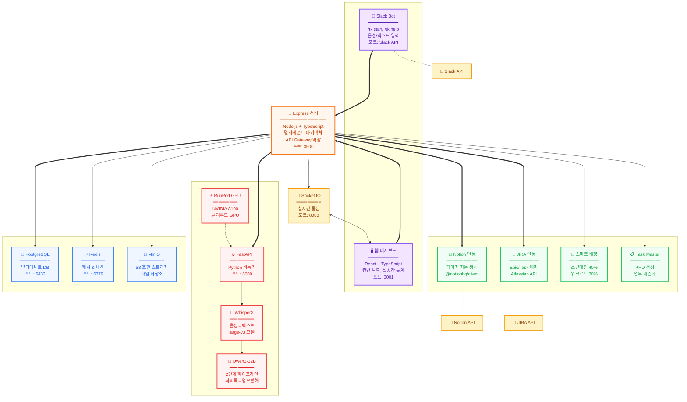
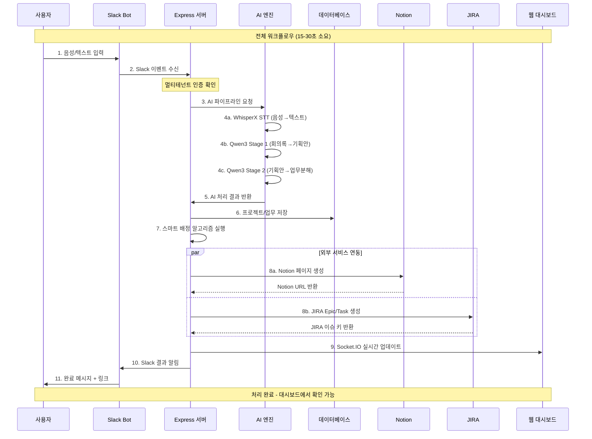
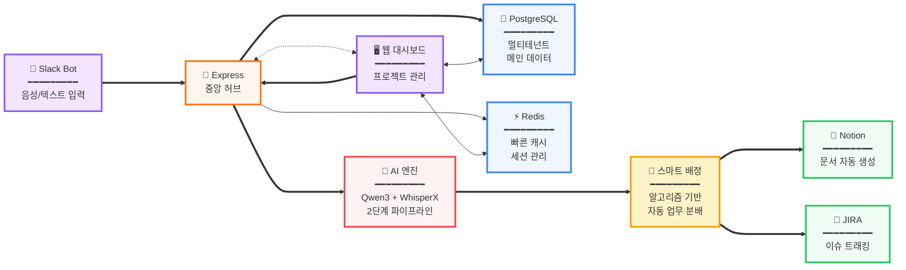
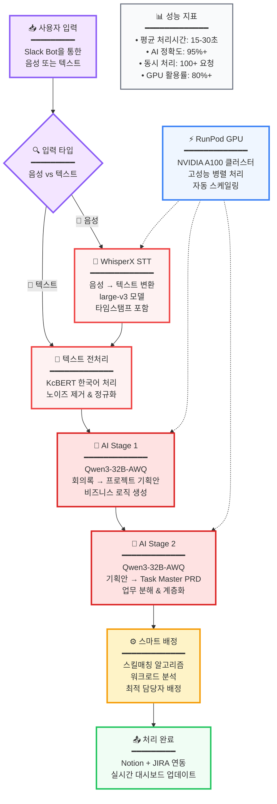
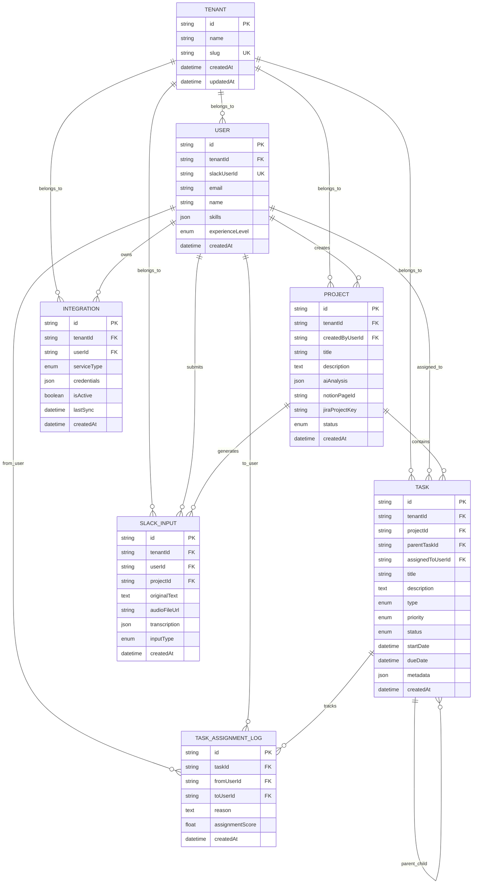
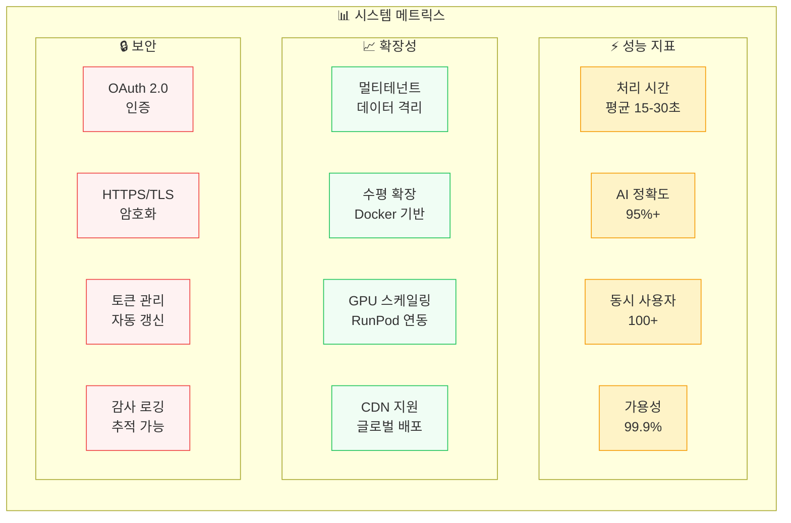
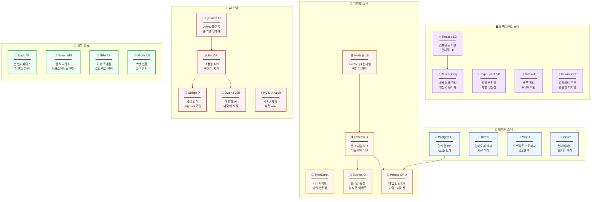

# TtalKkak AI 기반 프로젝트 관리 시스템 아키텍처

## 전체 시스템 아키텍처

## 데이터 플로우 다이어그램

## 핵심 컴포넌트 관계도

## AI 파이프라인 상세도

## 데이터베이스 ERD

## 시스템 메트릭스 & 성능

## 기술 스택 다이어그램

---

## 📋 시스템 정보 요약

### 포트 구성
- **백엔드**: 3500 (Express API)
- **프론트엔드**: 3001 (Vite 개발서버)  
- **AI 엔진**: 8000 (개발), 8001 (Docker)
- **PostgreSQL**: 5432
- **Redis**: 6379
- **Socket.IO**: 8080

### 주요 워크플로우
1. **Slack**에서 음성/텍스트 입력
2. **AI 엔진**이 2단계 파이프라인 처리
3. **스마트 알고리즘**으로 업무 배정
4. **Notion/JIRA**에 자동 연동
5. **실시간 대시보드** 업데이트

### 시스템 특징
- **멀티테넌트 아키텍처**: 완전한 데이터 격리
- **AI 기반 자동화**: 95%+ 정확도
- **실시간 협업**: Socket.IO 양방향 통신
- **확장 가능**: Docker + 클라우드 네이티브
- **보안**: OAuth 2.0 + HTTPS/TLS