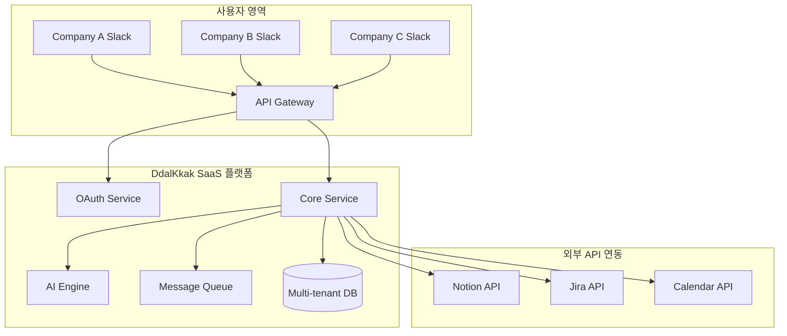
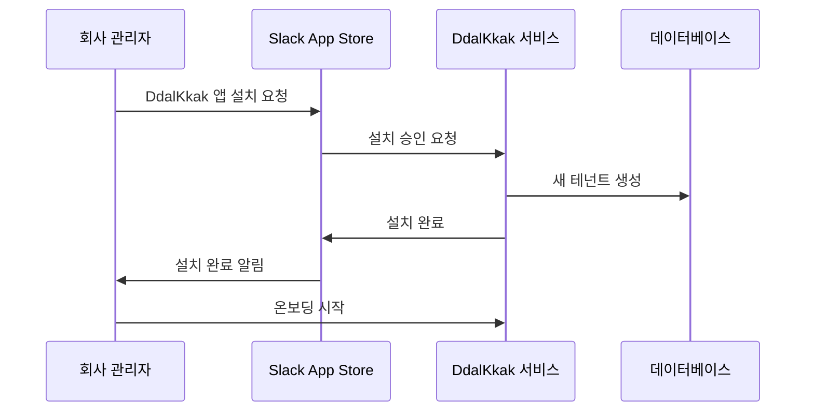
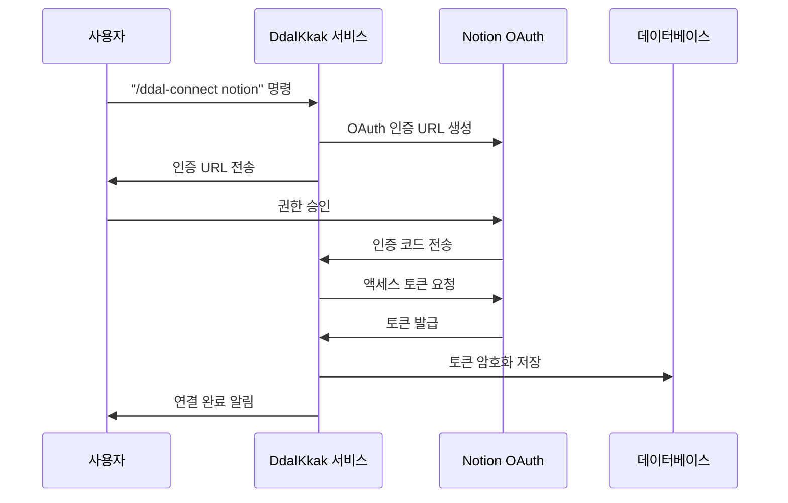

# 🚀 DdalKkak 상용 서비스 설계서
## Multi-tenant SaaS 슬랙 앱 배포 아키텍처

---

## 📋 문서 개요

**DdalKkak**을 여러 회사가 사용할 수 있는 **상용 SaaS 서비스**로 설계하는 완전한 아키텍처 문서입니다.

- **서비스 모델**: B2B SaaS (Software as a Service)
- **배포 방식**: 공개 Slack App Store 배포
- **사용자**: 여러 회사/팀 (Multi-tenant)
- **작성일**: 2024-01-15
- **버전**: v2.0 (상용 서비스)

---

## 🎯 상용 서비스 핵심 요구사항

### ✅ **지원해야 할 시나리오**
```
🏢 A회사: DdalKkak 설치 → A회사 Notion/Jira에 결과 생성
🏢 B회사: DdalKkak 설치 → B회사 Notion/Jira에 결과 생성
🏢 C회사: DdalKkak 설치 → C회사 Notion/Jira에 결과 생성
```

### 🔐 **보안 및 격리 요구사항**
- 각 회사 데이터 완전 격리
- 사용자별 인증 및 권한 관리
- 토큰 안전 저장 및 관리
- GDPR/SOC2 컴플라이언스

### 📈 **확장성 요구사항**
- 동시 사용자 수천 명 지원
- 글로벌 배포 (AWS Multi-Region)
- 자동 스케일링
- 99.9% 가용성 보장

---

## 🏗️ **전체 아키텍처 설계**

### 1. 🌐 **서비스 아키텍처 개요**



### 2. 🔐 **Multi-tenant 데이터 구조**

```sql
-- 테넌트 (회사) 관리
CREATE TABLE tenants (
    id UUID PRIMARY KEY,
    name VARCHAR(255) NOT NULL,
    slack_team_id VARCHAR(50) UNIQUE,
    plan_type VARCHAR(20) DEFAULT 'free',
    created_at TIMESTAMP DEFAULT NOW(),
    updated_at TIMESTAMP DEFAULT NOW()
);

-- 사용자 관리
CREATE TABLE users (
    id UUID PRIMARY KEY,
    tenant_id UUID REFERENCES tenants(id),
    slack_user_id VARCHAR(50),
    email VARCHAR(255),
    role VARCHAR(20) DEFAULT 'member',
    created_at TIMESTAMP DEFAULT NOW(),
    UNIQUE(tenant_id, slack_user_id)
);

-- 통합 서비스 토큰 관리
CREATE TABLE integrations (
    id UUID PRIMARY KEY,
    tenant_id UUID REFERENCES tenants(id),
    user_id UUID REFERENCES users(id),
    service_type VARCHAR(20), -- 'notion', 'jira', 'calendar'
    access_token TEXT ENCRYPTED,
    refresh_token TEXT ENCRYPTED,
    expires_at TIMESTAMP,
    workspace_info JSONB,
    created_at TIMESTAMP DEFAULT NOW(),
    UNIQUE(tenant_id, user_id, service_type)
);

-- 프로젝트 관리
CREATE TABLE projects (
    id UUID PRIMARY KEY,
    tenant_id UUID REFERENCES tenants(id),
    name VARCHAR(255),
    description TEXT,
    status VARCHAR(20) DEFAULT 'active',
    created_by UUID REFERENCES users(id),
    created_at TIMESTAMP DEFAULT NOW()
);

-- 회의 분석 결과
CREATE TABLE meeting_analyses (
    id UUID PRIMARY KEY,
    tenant_id UUID REFERENCES tenants(id),
    project_id UUID REFERENCES projects(id),
    meeting_title VARCHAR(255),
    analyzed_content JSONB,
    generated_tasks JSONB,
    integration_results JSONB,
    created_by UUID REFERENCES users(id),
    created_at TIMESTAMP DEFAULT NOW()
);
```

---

## 🔐 **OAuth 인증 시스템**

### 1. 🚀 **앱 설치 플로우**



### 2. 🔗 **통합 서비스 연결 플로우**



### 3. 🔑 **OAuth 설정 상세**

#### **Notion OAuth 설정**
```yaml
OAuth 앱 설정:
  App Name: "DdalKkak"
  Redirect URI: "https://api.ddalkkak.com/auth/notion/callback"
  Scopes:
    - read_content
    - write_content
    - read_database
    - write_database
    - read_user
```

#### **Jira OAuth 설정**
```yaml
OAuth 앱 설정:
  App Name: "DdalKkak"
  Redirect URI: "https://api.ddalkkak.com/auth/jira/callback"
  Scopes:
    - read:jira-work
    - write:jira-work
    - read:jira-user
    - manage:jira-project
```

#### **Google Calendar OAuth 설정**
```yaml
OAuth 앱 설정:
  App Name: "DdalKkak"
  Redirect URI: "https://api.ddalkkak.com/auth/google/callback"
  Scopes:
    - https://www.googleapis.com/auth/calendar
    - https://www.googleapis.com/auth/calendar.events
```

---

## 🖥️ **서비스 컴포넌트 설계**

### 1. 🚪 **API Gateway**
```typescript
// 테넌트별 요청 라우팅
export class TenantMiddleware {
  async handle(req: Request, res: Response, next: NextFunction) {
    const slackTeamId = req.headers['x-slack-team-id'];
    const tenant = await getTenantBySlackTeamId(slackTeamId);
    
    if (!tenant) {
      return res.status(404).json({ error: 'Tenant not found' });
    }
    
    req.tenant = tenant;
    req.tenantId = tenant.id;
    next();
  }
}

// 사용자 권한 확인
export class AuthMiddleware {
  async handle(req: Request, res: Response, next: NextFunction) {
    const slackUserId = req.headers['x-slack-user-id'];
    const user = await getUserBySlackId(req.tenantId, slackUserId);
    
    if (!user) {
      return res.status(401).json({ error: 'Unauthorized' });
    }
    
    req.user = user;
    next();
  }
}
```

### 2. 🔐 **OAuth 서비스**
```typescript
export class OAuthService {
  // Notion OAuth 처리
  async handleNotionCallback(tenantId: string, userId: string, code: string) {
    const tokenResponse = await this.exchangeCodeForToken('notion', code);
    
    const encryptedToken = await this.encryptToken(tokenResponse.access_token);
    
    await this.storeIntegration({
      tenant_id: tenantId,
      user_id: userId,
      service_type: 'notion',
      access_token: encryptedToken,
      refresh_token: tokenResponse.refresh_token,
      expires_at: new Date(Date.now() + tokenResponse.expires_in * 1000),
      workspace_info: await this.getNotionWorkspaceInfo(tokenResponse.access_token)
    });
  }
  
  // 사용자별 토큰 조회
  async getUserIntegration(tenantId: string, userId: string, serviceType: string) {
    const integration = await db.integrations.findFirst({
      where: { tenant_id: tenantId, user_id: userId, service_type: serviceType }
    });
    
    if (!integration) return null;
    
    const decryptedToken = await this.decryptToken(integration.access_token);
    return { ...integration, access_token: decryptedToken };
  }
}
```

### 3. 🤖 **AI 분석 서비스**
```typescript
export class AIAnalysisService {
  async analyzeMeeting(
    tenantId: string, 
    userId: string, 
    meetingData: MeetingData
  ) {
    // 1. 회의 분석
    const analysis = await this.aiEngine.analyzeMeeting(meetingData);
    
    // 2. 사용자 통합 서비스 조회
    const integrations = await this.getUserIntegrations(tenantId, userId);
    
    // 3. 결과 생성 및 저장
    const results = await Promise.all([
      this.createNotionPages(integrations.notion, analysis),
      this.createJiraIssues(integrations.jira, analysis),
      this.createCalendarEvents(integrations.calendar, analysis)
    ]);
    
    // 4. 결과 데이터베이스 저장
    await this.saveMeetingAnalysis(tenantId, userId, analysis, results);
    
    return { analysis, integrationResults: results };
  }
}
```

---

## 🎛️ **관리자 대시보드**

### 1. 📊 **SaaS 메트릭스 대시보드**
```typescript
// 서비스 전체 통계
interface SaaSMetrics {
  totalTenants: number;
  activeTenants: number;
  totalUsers: number;
  dailyActiveUsers: number;
  monthlyRecurringRevenue: number;
  churnRate: number;
  avgMeetingsPerTenant: number;
  totalMeetingsAnalyzed: number;
}

// 테넌트별 사용량
interface TenantUsage {
  tenantId: string;
  tenantName: string;
  userCount: number;
  meetingCount: number;
  planType: string;
  lastActiveDate: Date;
  integrationStatus: {
    notion: boolean;
    jira: boolean;
    calendar: boolean;
  };
}
```

### 2. 🎯 **테넌트 관리 시스템**
```typescript
export class TenantManagementService {
  // 테넌트 생성
  async createTenant(slackTeamId: string, teamInfo: SlackTeamInfo) {
    const tenant = await db.tenants.create({
      data: {
        id: generateUUID(),
        name: teamInfo.name,
        slack_team_id: slackTeamId,
        plan_type: 'free',
        created_at: new Date()
      }
    });
    
    // 기본 설정 초기화
    await this.initializeTenantDefaults(tenant.id);
    
    return tenant;
  }
  
  // 테넌트 사용량 조회
  async getTenantUsage(tenantId: string) {
    const usage = await db.raw(`
      SELECT 
        COUNT(DISTINCT u.id) as user_count,
        COUNT(DISTINCT ma.id) as meeting_count,
        COUNT(DISTINCT i.service_type) as integration_count
      FROM tenants t
      LEFT JOIN users u ON t.id = u.tenant_id
      LEFT JOIN meeting_analyses ma ON t.id = ma.tenant_id
      LEFT JOIN integrations i ON t.id = i.tenant_id
      WHERE t.id = ?
    `, [tenantId]);
    
    return usage[0];
  }
}
```

---

## 💳 **구독 및 결제 시스템**

### 1. 📋 **요금제 설계**

```typescript
interface PricingPlan {
  id: string;
  name: string;
  price: number;
  currency: string;
  billing_cycle: 'monthly' | 'annually';
  features: {
    max_users: number;
    max_meetings_per_month: number;
    storage_gb: number;
    integrations: string[];
    support_level: 'community' | 'standard' | 'premium';
    custom_branding: boolean;
  };
}

const PRICING_PLANS: PricingPlan[] = [
  {
    id: 'free',
    name: 'Free',
    price: 0,
    currency: 'USD',
    billing_cycle: 'monthly',
    features: {
      max_users: 5,
      max_meetings_per_month: 10,
      storage_gb: 1,
      integrations: ['notion', 'jira'],
      support_level: 'community',
      custom_branding: false
    }
  },
  {
    id: 'professional',
    name: 'Professional',
    price: 49,
    currency: 'USD',
    billing_cycle: 'monthly',
    features: {
      max_users: 50,
      max_meetings_per_month: 100,
      storage_gb: 10,
      integrations: ['notion', 'jira', 'calendar', 'github'],
      support_level: 'standard',
      custom_branding: true
    }
  },
  {
    id: 'enterprise',
    name: 'Enterprise',
    price: 199,
    currency: 'USD',
    billing_cycle: 'monthly',
    features: {
      max_users: -1, // unlimited
      max_meetings_per_month: -1, // unlimited
      storage_gb: 100,
      integrations: ['all'],
      support_level: 'premium',
      custom_branding: true
    }
  }
];
```

### 2. 💰 **Stripe 결제 연동**
```typescript
export class SubscriptionService {
  async createSubscription(tenantId: string, planId: string) {
    const tenant = await db.tenants.findUnique({ where: { id: tenantId } });
    const plan = PRICING_PLANS.find(p => p.id === planId);
    
    // Stripe 고객 생성
    const customer = await stripe.customers.create({
      email: tenant.email,
      metadata: { tenant_id: tenantId }
    });
    
    // 구독 생성
    const subscription = await stripe.subscriptions.create({
      customer: customer.id,
      items: [{ price: plan.stripe_price_id }],
      metadata: { tenant_id: tenantId, plan_id: planId }
    });
    
    // 데이터베이스 업데이트
    await db.tenants.update({
      where: { id: tenantId },
      data: {
        plan_type: planId,
        stripe_customer_id: customer.id,
        stripe_subscription_id: subscription.id
      }
    });
    
    return subscription;
  }
}
```

---

## 🔒 **보안 및 컴플라이언스**

### 1. 🛡️ **데이터 보안**
```typescript
export class SecurityService {
  // 토큰 암호화
  async encryptToken(token: string): Promise<string> {
    const algorithm = 'aes-256-gcm';
    const key = Buffer.from(process.env.ENCRYPTION_KEY!, 'hex');
    const iv = crypto.randomBytes(16);
    
    const cipher = crypto.createCipher(algorithm, key);
    cipher.setAAD(Buffer.from('ddalkkak-token'));
    
    let encrypted = cipher.update(token, 'utf8', 'hex');
    encrypted += cipher.final('hex');
    
    const authTag = cipher.getAuthTag();
    
    return iv.toString('hex') + ':' + authTag.toString('hex') + ':' + encrypted;
  }
  
  // 토큰 복호화
  async decryptToken(encryptedToken: string): Promise<string> {
    const [ivHex, authTagHex, encrypted] = encryptedToken.split(':');
    const key = Buffer.from(process.env.ENCRYPTION_KEY!, 'hex');
    const iv = Buffer.from(ivHex, 'hex');
    const authTag = Buffer.from(authTagHex, 'hex');
    
    const decipher = crypto.createDecipher('aes-256-gcm', key);
    decipher.setAAD(Buffer.from('ddalkkak-token'));
    decipher.setAuthTag(authTag);
    
    let decrypted = decipher.update(encrypted, 'hex', 'utf8');
    decrypted += decipher.final('utf8');
    
    return decrypted;
  }
}
```

### 2. 🔐 **접근 제어**
```typescript
export class AccessControlService {
  // 테넌트별 데이터 접근 제어
  async checkTenantAccess(userId: string, tenantId: string): Promise<boolean> {
    const user = await db.users.findFirst({
      where: { id: userId, tenant_id: tenantId }
    });
    
    return !!user;
  }
  
  // 리소스 접근 권한 확인
  async checkResourceAccess(
    userId: string, 
    resourceType: string, 
    resourceId: string
  ): Promise<boolean> {
    const user = await db.users.findUnique({ where: { id: userId } });
    
    switch (resourceType) {
      case 'meeting_analysis':
        const analysis = await db.meeting_analyses.findUnique({
          where: { id: resourceId }
        });
        return analysis?.tenant_id === user?.tenant_id;
      
      case 'project':
        const project = await db.projects.findUnique({
          where: { id: resourceId }
        });
        return project?.tenant_id === user?.tenant_id;
      
      default:
        return false;
    }
  }
}
```

---

## 📊 **모니터링 및 로깅**

### 1. 📈 **메트릭스 수집**
```typescript
export class MetricsService {
  // 사용량 메트릭스
  async collectUsageMetrics() {
    const metrics = await db.raw(`
      SELECT 
        DATE(created_at) as date,
        COUNT(*) as meeting_count,
        COUNT(DISTINCT tenant_id) as active_tenants,
        COUNT(DISTINCT created_by) as active_users
      FROM meeting_analyses
      WHERE created_at >= NOW() - INTERVAL '30 days'
      GROUP BY DATE(created_at)
      ORDER BY date DESC
    `);
    
    return metrics;
  }
  
  // 성능 메트릭스
  async collectPerformanceMetrics() {
    return {
      avg_analysis_time: await this.getAverageAnalysisTime(),
      api_response_time: await this.getApiResponseTime(),
      error_rate: await this.getErrorRate(),
      uptime: await this.getUptime()
    };
  }
}
```

### 2. 📝 **감사 로깅**
```typescript
export class AuditLogService {
  async log(event: AuditEvent) {
    await db.audit_logs.create({
      data: {
        tenant_id: event.tenantId,
        user_id: event.userId,
        action: event.action,
        resource_type: event.resourceType,
        resource_id: event.resourceId,
        ip_address: event.ipAddress,
        user_agent: event.userAgent,
        timestamp: new Date(),
        metadata: event.metadata
      }
    });
  }
}
```

---

## 🚀 **배포 및 운영**

### 1. 🐳 **Docker 컨테이너 설정**
```dockerfile
# Multi-stage build
FROM node:18-alpine AS builder
WORKDIR /app
COPY package*.json ./
RUN npm ci --only=production

FROM node:18-alpine AS runtime
WORKDIR /app
COPY --from=builder /app/node_modules ./node_modules
COPY . .
EXPOSE 3000
CMD ["npm", "start"]
```

### 2. ☸️ **Kubernetes 배포**
```yaml
apiVersion: apps/v1
kind: Deployment
metadata:
  name: ddalkkak-api
spec:
  replicas: 3
  selector:
    matchLabels:
      app: ddalkkak-api
  template:
    metadata:
      labels:
        app: ddalkkak-api
    spec:
      containers:
      - name: api
        image: ddalkkak/api:latest
        ports:
        - containerPort: 3000
        env:
        - name: DATABASE_URL
          valueFrom:
            secretKeyRef:
              name: ddalkkak-secrets
              key: database-url
        - name: ENCRYPTION_KEY
          valueFrom:
            secretKeyRef:
              name: ddalkkak-secrets
              key: encryption-key
        resources:
          requests:
            memory: "256Mi"
            cpu: "250m"
          limits:
            memory: "512Mi"
            cpu: "500m"
```

### 3. 🌐 **AWS 인프라 구성**
```yaml
# Infrastructure as Code (Terraform)
resource "aws_ecs_cluster" "ddalkkak" {
  name = "ddalkkak-cluster"
}

resource "aws_rds_cluster" "ddalkkak" {
  cluster_identifier = "ddalkkak-db"
  engine             = "aurora-postgresql"
  engine_mode        = "provisioned"
  database_name      = "ddalkkak"
  master_username    = "admin"
  master_password    = var.db_password
  
  backup_retention_period = 7
  preferred_backup_window = "07:00-09:00"
  
  vpc_security_group_ids = [aws_security_group.rds.id]
  db_subnet_group_name   = aws_db_subnet_group.ddalkkak.name
  
  encryption_config {
    kms_key_id = aws_kms_key.ddalkkak.arn
  }
}

resource "aws_elasticache_cluster" "ddalkkak" {
  cluster_id           = "ddalkkak-cache"
  engine               = "redis"
  node_type            = "cache.t3.micro"
  num_cache_nodes      = 1
  parameter_group_name = "default.redis7"
  port                 = 6379
  subnet_group_name    = aws_elasticache_subnet_group.ddalkkak.name
  security_group_ids   = [aws_security_group.elasticache.id]
}
```

---

## 📈 **성장 및 확장 전략**

### 1. 🎯 **초기 시장 진입**
```yaml
Phase 1 (0-6개월):
  - 목표: 100개 팀 온보딩
  - 전략: 무료 플랜 제공
  - 마케팅: 제품 헌트, 해커뉴스
  - 피처: 기본 회의 분석, Notion/Jira 연동

Phase 2 (6-12개월):
  - 목표: 1,000개 팀 온보딩
  - 전략: 유료 플랜 출시
  - 마케팅: 콘텐츠 마케팅, 파트너쉽
  - 피처: 고급 분석, 다중 연동

Phase 3 (12-24개월):
  - 목표: 10,000개 팀 온보딩
  - 전략: 엔터프라이즈 영업
  - 마케팅: 컨퍼런스, 웨비나
  - 피처: 커스텀 통합, 화이트라벨
```

### 2. 🔄 **제품 로드맵**
```yaml
Q1 2024:
  - ✅ 기본 회의 분석 기능
  - ✅ Notion/Jira 연동
  - ✅ 멀티 테넌트 아키텍처
  - 🔄 사용자 온보딩 개선

Q2 2024:
  - 📋 Google Calendar 연동
  - 📋 실시간 STT 기능
  - 📋 모바일 앱 출시
  - 📋 API 문서화

Q3 2024:
  - 📋 GitHub 연동
  - 📋 Microsoft Teams 지원
  - 📋 커스텀 워크플로우
  - 📋 분석 리포트 기능

Q4 2024:
  - 📋 AI 인사이트 대시보드
  - 📋 화이트라벨 솔루션
  - 📋 엔터프라이즈 보안 강화
  - 📋 글로벌 확장 (다국어)
```

---

## 🎉 **출시 준비 체크리스트**

### 📋 **기술적 준비사항**
- [ ] 멀티 테넌트 아키텍처 구현
- [ ] OAuth 인증 시스템 완료
- [ ] 데이터베이스 마이그레이션 스크립트
- [ ] API 문서화 (OpenAPI)
- [ ] 자동화된 테스트 스위트
- [ ] 모니터링 및 알림 시스템
- [ ] 백업 및 복구 프로세스
- [ ] 보안 감사 완료

### 📋 **비즈니스 준비사항**
- [ ] 개인정보 처리방침 작성
- [ ] 서비스 이용약관 작성
- [ ] 고객 지원 시스템 구축
- [ ] 결제 시스템 연동 (Stripe)
- [ ] 마케팅 웹사이트 구축
- [ ] 사용자 가이드 및 FAQ
- [ ] 초기 베타 사용자 모집
- [ ] 가격 정책 확정

### 📋 **Slack App Store 제출**
- [ ] 앱 메타데이터 준비
- [ ] 스크린샷 및 데모 비디오
- [ ] 앱 설명 및 키워드 최적화
- [ ] 권한 설명 및 사용 사례
- [ ] 리뷰 프로세스 준비
- [ ] 사용자 피드백 수집 계획

---

## 🎯 **성공 지표 (KPI)**

### 📊 **사용자 메트릭스**
```typescript
interface UserMetrics {
  // 성장 지표
  totalTenants: number;
  monthlyActiveUsers: number;
  userRetentionRate: number;
  
  // 참여 지표
  avgMeetingsPerUser: number;
  avgAnalysisTime: number;
  integrationAdoptionRate: number;
  
  // 만족도 지표
  npsScore: number;
  supportTicketResolutionTime: number;
  churnRate: number;
}
```

### 💰 **비즈니스 메트릭스**
```typescript
interface BusinessMetrics {
  // 매출 지표
  monthlyRecurringRevenue: number;
  annualRecurringRevenue: number;
  averageRevenuePerUser: number;
  
  // 효율성 지표
  customerAcquisitionCost: number;
  lifetimeValue: number;
  paybackPeriod: number;
  
  // 운영 지표
  serverUptime: number;
  apiResponseTime: number;
  errorRate: number;
}
```

---

## 🔚 **결론**

이 설계서는 **DdalKkak을 상용 SaaS 서비스로 배포**하기 위한 완전한 아키텍처를 제시합니다.

### 🎯 **핵심 특징**
- ✅ **Multi-tenant 구조**: 여러 회사 동시 지원
- ✅ **OAuth 기반 인증**: 안전한 사용자 인증
- ✅ **확장 가능한 아키텍처**: 수천 개 팀 지원
- ✅ **완전한 데이터 격리**: 회사별 보안 보장
- ✅ **SaaS 비즈니스 모델**: 구독 기반 수익화

### 🚀 **다음 단계**
1. **MVP 개발** (2-3개월)
2. **베타 테스트** (1개월)
3. **Slack App Store 제출** (1개월)
4. **공식 출시** (6개월 후)

이제 **진짜 상용 서비스**로 만들 수 있습니다! 🎉

---

**마지막 업데이트**: 2024-01-15  
**문서 버전**: v2.0 (Commercial SaaS)  
**다음 리뷰 예정**: 2024-02-01 