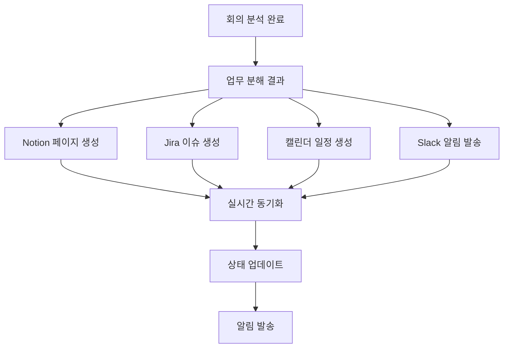

# 🤖 DdalKkak 연동 아웃풋 설계서

## 📋 문서 개요

**DdalKkak AI 업무 자동화 시스템**에서 회의 분석 후 생성되는 모든 연동 결과물의 상세 설계서입니다.

- **작성일**: 2024-01-15
- **버전**: v1.0
- **작성자**: DdalKkak Development Team

---

## 🎯 연동 플랫폼 개요

### 지원 플랫폼
- **📝 Notion**: 문서화, 프로젝트 관리, 지식 베이스
- **🔧 Jira**: 이슈 추적, 스프린트 관리, 워크플로우
- **📅 Calendar**: 일정 관리 (Google Calendar, Outlook)
- **💬 Slack**: 실시간 알림 및 협업
- **📧 Email**: 업무 배정 및 상태 알림

---

## 📝 Notion 연동 아웃풋

### 1. 📋 프로젝트 워크스페이스 구조

```
📁 DdalKkak 프로젝트
├── 📄 프로젝트 대시보드
├── 📂 회의록 아카이브
│   ├── 📄 2024-01-15_모바일앱개선회의
│   ├── 📄 2024-01-14_보안강화논의
│   └── 📄 ...
├── 📂 기획안 저장소
│   ├── 📄 모바일 앱 개선 기획안
│   ├── 📄 보안 강화 프로젝트 기획안
│   └── 📄 ...
├── 📊 업무 칸반 보드
├── 👥 팀원 프로필 데이터베이스
├── 📈 프로젝트 진행 현황
└── 📅 마일스톤 관리
```

### 2. 📄 프로젝트 대시보드 구성

#### **메타데이터**
```yaml
제목: "[프로젝트명] 대시보드"
생성일: 자동 (회의 분석 완료 시점)
마지막 업데이트: 실시간 동기화
담당자: 프로젝트 매니저 (자동 배정)
상태: 진행중/완료/보류
```

#### **대시보드 콘텐츠**
1. **📊 프로젝트 개요**
   - 프로젝트명 및 설명
   - 시작일/종료일
   - 전체 진행률 (%)
   - 참여 팀원 수

2. **🎯 핵심 지표**
   - 총 업무 수: `{total_tasks}`
   - 완료된 업무: `{completed_tasks}`
   - 진행 중 업무: `{in_progress_tasks}`
   - 지연된 업무: `{delayed_tasks}`

3. **📋 업무 요약**
   - 우선순위별 업무 분포
   - 담당자별 업무 배정 현황
   - 마감일 임박 업무 알림

4. **🔗 빠른 링크**
   - Jira 프로젝트 바로가기
   - Slack 채널 바로가기
   - 캘린더 일정 바로가기

### 3. 📄 회의록 페이지 구성

#### **템플릿 구조**
```markdown
# 📅 [회의명] - [날짜]

## 📋 **필수 항목**

### 🏷️ **프로젝트명**
[AI가 분석한 프로젝트명]

### 🎯 **기획의 목적**
[AI가 분석한 기획 목적 및 배경]

### 📌 **주제**
[AI가 추출한 핵심 주제]

### 💡 **핵심아이디어**
#### 🔧 **기술**
- [기술적 접근 방법]
- [사용할 기술 스택]
- [기술적 해결책]

#### 📄 **내용**
- [핵심 콘텐츠]
- [주요 기능]
- [구현 방안]

### 📅 **일정**
- **프로젝트 시작일**: YYYY-MM-DD
- **주요 마일스톤**: 
  - 1차 완료: YYYY-MM-DD
  - 2차 완료: YYYY-MM-DD
  - 최종 완료: YYYY-MM-DD
- **전체 기간**: N주 (예상)

---

## 📋 **선택 항목**

### 📍 **회의 정보** (선택)
- **일시**: YYYY-MM-DD HH:MM
- **장소**: 온라인/오프라인 위치
- **참석자**: @멘션으로 연결된 팀원 목록
- **회의 유형**: 기획/개발/스프린트/리뷰

### 📝 **상세 논의사항** (선택)
#### 1. [세부 주제 1]
- **내용**: [AI가 추출한 핵심 내용]
- **결정사항**: [결론 및 합의 사항]
- **액션 아이템**: [도출된 업무들]

#### 2. [세부 주제 2]
- **내용**: [AI가 추출한 핵심 내용]
- **결정사항**: [결론 및 합의 사항]
- **액션 아이템**: [도출된 업무들]

### ✅ **액션 아이템 요약** (선택)
| 업무명 | 담당자 | 우선순위 | 마감일 | 상태 |
|--------|--------|----------|--------|------|
| [업무1] | @담당자 | 높음 | 2024-01-25 | 📋 할 일 |
| [업무2] | @담당자 | 보통 | 2024-01-30 | 📋 할 일 |

### 🔄 **다음 회의** (선택)
- **예정일**: [다음 회의 일정]
- **안건**: [예상 논의 사항]

### 🔗 **관련 링크** (선택)
- [Jira Epic 바로가기]
- [Slack 토론 채널]
- [관련 문서들]
```

### 4. 📊 업무 칸반 보드 구성

#### **칸반 보드 구조**
```
📋 백로그 | 🔄 진행 중 | 👀 검토 중 | ✅ 완료
   (12)   |    (8)     |    (5)     |   (23)
```

#### **업무 카드 속성**
```yaml
업무 ID: DDAL-001
제목: "UI/UX 디자인 개선"
설명: "사용자 경험 개선을 위한 인터페이스 재설계"
담당자: @김디자인
우선순위: 높음/보통/낮음
태그: [디자인, UI/UX, 개선]
시작일: 2024-01-15
마감일: 2024-01-25
예상 소요시간: 40시간
현재 상태: 진행 중
진행률: 60%
Jira 링크: [자동 연결]
관련 회의: [회의록 링크]
```

### 5. 👥 팀원 프로필 데이터베이스

#### **팀원 프로필 속성**
```yaml
이름: 김개발
역할: Frontend 개발자
이메일: kim@company.com
Slack ID: @kim.dev
기술 스택: [React, TypeScript, Next.js]
경력 수준: 미드 (3-5년)
현재 업무량: 70%
가용 시간: 주 32시간
선호 업무 유형: [UI 개발, API 연동]
최근 성과: 8.5/10
배정된 업무: [링크된 업무 목록]
```

---

## 🔧 Jira 연동 아웃풋

### 1. 📋 프로젝트 구조

```
🏗️ DdalKkak Project (DDAL)
├── 📈 Epic: 모바일 앱 개선 (DDAL-E001)
│   ├── 📋 Story: UI/UX 디자인 개선 (DDAL-001)
│   │   ├── 🔧 Sub-task: 와이어프레임 작성 (DDAL-001-1)
│   │   ├── 🔧 Sub-task: 프로토타입 제작 (DDAL-001-2)
│   │   └── 🔧 Sub-task: 사용성 테스트 (DDAL-001-3)
│   ├── 📋 Story: API 성능 최적화 (DDAL-002)
│   └── 📋 Story: 모바일 반응형 구현 (DDAL-003)
└── 📈 Epic: 보안 강화 프로젝트 (DDAL-E002)
    ├── 📋 Story: 인증 시스템 개선 (DDAL-004)
    └── 📋 Story: 데이터 암호화 (DDAL-005)
```

### 2. 📈 Epic 생성 규칙

#### **Epic 메타데이터**
```yaml
Epic 키: DDAL-E001
제목: "[회의명에서 추출된 프로젝트명]"
설명: "[AI가 분석한 프로젝트 개요]"
Epic 링크: "[Notion 기획안 페이지 URL]"
라벨: [auto-generated, meeting-derived]
컴포넌트: [Frontend, Backend, Design, QA]
Epic 상태: To Do → In Progress → Done
우선순위: Highest/High/Medium/Low
시작일: [회의 날짜]
목표 완료일: [AI 예측 + 버퍼]
담당자: [프로젝트 매니저]
```

### 3. 📋 Story/Task 생성 규칙

#### **Story 메타데이터**
```yaml
이슈 키: DDAL-001
이슈 유형: Story/Task/Bug
제목: "[AI가 추출한 업무명]"
설명: |
  ## 📋 업무 설명
  [AI가 분석한 상세 내용]
  
  ## 🎯 완료 조건
  - [ ] [세부 완료 기준 1]
  - [ ] [세부 완료 기준 2]
  - [ ] [세부 완료 기준 3]
  
  ## 🔗 관련 링크
  - [Notion 회의록 링크]
  - [관련 문서 링크]

담당자: "[AI 매칭 알고리즘 결과]"
우선순위: "[회의 내용 기반 자동 설정]"
Epic 링크: DDAL-E001
스토리 포인트: "[복잡도 기반 자동 산정]"
라벨: [기술스택, 업무유형, 우선순위]
컴포넌트: [해당하는 시스템 컴포넌트]
Fix Version: [목표 릴리즈 버전]
```

#### **사용자 정의 필드**
```yaml
회의 출처: "[회의록 링크]"
AI 신뢰도: 85% (AI 분석 정확도)
예상 소요시간: 40시간
스킬 매칭 점수: 92%
업무 복잡도: 중간
Dependencies: [연관 업무 목록]
```

### 4. 🏃‍♂️ 스프린트 자동 배정

#### **스프린트 배정 로직**
```yaml
스프린트 이름: "Sprint 2024-W03 (모바일 앱 개선)"
기간: 2주 (14일)
시작일: 다음 월요일
종료일: 2주 후 금요일
목표: "[Epic에서 추출된 스프린트 목표]"
포함 업무: [우선순위 + 용량 기반 자동 선택]
총 스토리 포인트: 42 (팀 벨로시티 기반)
```

### 5. 🔄 워크플로우 설정

#### **업무 상태 플로우**
```
📋 To Do → 🔄 In Progress → 👀 Code Review → 🧪 QA Testing → ✅ Done
```

#### **자동 전환 조건**
- **To Do → In Progress**: 담당자가 업무 시작 버튼 클릭
- **In Progress → Code Review**: PR 생성 시 자동 전환
- **Code Review → QA Testing**: PR 승인 시 자동 전환
- **QA Testing → Done**: QA 승인 시 자동 전환

---

## 📅 캘린더 연동 아웃풋

### 1. 📆 일정 생성 규칙

#### **프로젝트 마일스톤**
```yaml
제목: "[프로젝트명] 킥오프 미팅"
날짜: [회의 다음 영업일]
시간: 오전 10:00 - 11:00
참석자: [프로젝트 팀원 전체]
위치: 회의실 A / Zoom 링크
설명: |
  🎯 목적: 프로젝트 킥오프 및 업무 분장
  📋 안건:
  - 프로젝트 개요 공유
  - 업무 분장 확인
  - 일정 및 마일스톤 검토
  - Q&A
```

#### **개별 업무 마감일**
```yaml
제목: "📋 [업무명] 마감"
날짜: [AI 예측 마감일]
시간: 종일 이벤트
참석자: [담당자]
알림: 3일 전, 1일 전, 당일
분류: 업무 마감
```

#### **정기 체크인 미팅**
```yaml
제목: "🔄 [프로젝트명] 주간 체크인"
날짜: 매주 금요일
시간: 오후 3:00 - 4:00
반복: 프로젝트 종료까지
참석자: [프로젝트 팀원]
안건: 진행 상황 공유 및 이슈 논의
```

---

## 💬 Slack 연동 아웃풋

### 1. 🏠 채널 생성

#### **프로젝트 전용 채널**
```yaml
채널명: "#ddal-mobile-app-improvement"
설명: "📱 모바일 앱 개선 프로젝트 전용 채널"
멤버: [프로젝트 팀원 자동 초대]
고정 메시지: |
  🎯 프로젝트: 모바일 앱 개선
  📅 기간: 2024-01-15 ~ 2024-03-15
  🔗 링크:
  - [Notion 프로젝트 대시보드]
  - [Jira 프로젝트]
  - [캘린더 일정]
```

### 2. 📢 자동 알림 메시지

#### **프로젝트 시작 알림**
```markdown
🎉 새 프로젝트가 시작되었습니다!

📱 **프로젝트**: 모바일 앱 개선
📅 **기간**: 2024-01-15 ~ 2024-03-15
👥 **팀원**: @김디자인 @박백엔드 @이프론트

📋 **생성된 업무**: 5개
🔗 **Jira Epic**: [DDAL-E001 바로가기]
📝 **Notion 대시보드**: [바로가기]

---
💡 업무가 자동으로 배정되었습니다. 각자 Jira에서 확인해주세요!
```

#### **업무 배정 알림**
```markdown
📋 새 업무가 배정되었습니다!

**@김디자인**님께 업무가 배정되었습니다.

🎨 **업무**: UI/UX 디자인 개선
📅 **마감일**: 2024-01-25
🎯 **우선순위**: 높음
🔗 **Jira 링크**: [DDAL-001 바로가기]

📝 **설명**: 사용자 경험 개선을 위한 인터페이스 재설계

---
❓ 질문이나 이슈가 있으면 언제든 말씀해주세요!
```

#### **마감일 알림**
```markdown
⏰ 마감일 알림

**@박백엔드**님의 업무 마감일이 다가왔습니다.

🔧 **업무**: API 성능 최적화
📅 **마감일**: 내일 (2024-01-20)
📊 **진행률**: 75%

🔗 **Jira에서 확인**: [DDAL-002 바로가기]

---
💪 조금만 더 힘내세요! 거의 다 왔어요!
```

---

## 📧 이메일 연동 아웃풋

### 1. 📬 이메일 템플릿

#### **프로젝트 킥오프 이메일**
```html
제목: [DdalKkak] 🚀 모바일 앱 개선 프로젝트 킥오프

안녕하세요, {팀원명}님!

DdalKkak AI 분석을 통해 새로운 프로젝트가 시작되었습니다.

📱 프로젝트: 모바일 앱 개선
📅 기간: 2024-01-15 ~ 2024-03-15
🎯 목표: 사용자 경험 개선 및 성능 최적화

🔗 주요 링크:
- Notion 프로젝트 대시보드: [링크]
- Jira 프로젝트: [링크]
- Slack 채널: #ddal-mobile-app-improvement

👥 팀원:
- 김디자인 (UI/UX 디자이너)
- 박백엔드 (백엔드 개발자)
- 이프론트 (프론트엔드 개발자)

📋 귀하의 배정 업무:
1. UI/UX 디자인 개선 (우선순위: 높음, 마감: 01/25)

프로젝트 성공을 위해 함께 노력해요! 💪

---
DdalKkak AI Assistant
자동 생성된 메일입니다.
```

#### **업무 완료 알림**
```html
제목: [DdalKkak] ✅ 업무 완료 - UI/UX 디자인 개선

{담당자명}님이 업무를 완료했습니다!

✅ 완료된 업무: UI/UX 디자인 개선
👤 담당자: 김디자인
📅 완료일: 2024-01-24
⏱️ 소요시간: 38시간 (예상: 40시간)

📊 프로젝트 진행 상황:
- 전체 진행률: 45% → 60%
- 완료된 업무: 2/5개
- 남은 업무: 3개

🔗 상세 확인: [Jira 링크]

---
DdalKkak AI Assistant
```

---

## 🔄 실시간 동기화 규칙

### 1. 📊 데이터 동기화

#### **양방향 동기화**
```yaml
Notion ↔ Jira:
  - 업무 상태 변경 시 실시간 반영
  - 담당자 변경 시 즉시 업데이트
  - 마감일 수정 시 캘린더 자동 업데이트

Jira → Slack:
  - 이슈 상태 변경 시 채널 알림
  - 새 댓글 추가 시 관련자 멘션
  - 마감일 임박 시 자동 알림

Calendar → All:
  - 일정 변경 시 모든 플랫폼 업데이트
  - 회의 시간 변경 시 자동 알림 발송
```

### 2. 🔔 알림 규칙

#### **중요도별 알림 채널**
```yaml
긴급 (우선순위: 높음):
  - Slack 즉시 알림
  - 이메일 즉시 발송
  - SMS 알림 (선택사항)

일반 (우선순위: 보통):
  - Slack 알림
  - 이메일 일일 다이제스트

정보성 (우선순위: 낮음):
  - 주간 리포트에 포함
```

---

## 📈 성과 측정 및 리포트

### 1. 📊 자동 생성 리포트

#### **주간 진행 리포트**
```markdown
# 📊 DdalKkak 주간 리포트
**기간**: 2024-01-15 ~ 2024-01-21

## 📈 주요 지표
- 완료된 업무: 8개 (+3개)
- 새로 생성된 업무: 12개
- 평균 완료 시간: 2.3일
- 팀 효율성: 94% (+2%)

## 🏆 이번 주 성과
- ✅ UI/UX 디자인 개선 완료 (김디자인)
- ✅ API 최적화 1차 완료 (박백엔드)
- 🔄 모바일 반응형 80% 진행 (이프론트)

## ⚠️ 주의 사항
- 보안 강화 업무 지연 (원인: 외부 의존성)
- QA 테스트 리소스 부족

## 📋 다음 주 계획
- 모바일 반응형 구현 완료
- 보안 강화 2차 작업 시작
- 성능 테스트 진행

---
🤖 DdalKkak AI가 자동 생성한 리포트입니다.
```

### 2. 📈 KPI 대시보드

#### **실시간 메트릭**
```yaml
회의 분석 정확도: 89%
업무 분해 정확도: 92%
팀원 배정 만족도: 94%
평균 업무 완료 시간: 2.3일
프로젝트 성공률: 87%
시간 절약률: 67%
```

---

## 🔧 기술적 구현 상세

### 1. 🔌 API 연동 스펙

#### **Notion API**
```yaml
엔드포인트: https://api.notion.com/v1/
인증: Bearer Token
주요 작업:
  - 페이지 생성: POST /pages
  - 데이터베이스 업데이트: PATCH /databases/{id}
  - 블록 추가: PATCH /blocks/{id}/children
  - 프로퍼티 업데이트: PATCH /pages/{id}
```

#### **Jira API**
```yaml
엔드포인트: https://{domain}.atlassian.net/rest/api/3/
인증: API Token
주요 작업:
  - 이슈 생성: POST /issue
  - 이슈 업데이트: PUT /issue/{key}
  - Epic 생성: POST /issue (issuetype: Epic)
  - 스프린트 배정: POST /sprint/{id}/issue
```

#### **Calendar API**
```yaml
Google Calendar:
  - 엔드포인트: https://www.googleapis.com/calendar/v3/
  - 인증: OAuth 2.0
  - 주요 작업: 이벤트 생성, 수정, 삭제

Outlook Calendar:
  - 엔드포인트: https://graph.microsoft.com/v1.0/
  - 인증: Microsoft Graph API
  - 주요 작업: 이벤트 관리, 참석자 초대
```

### 2. 🔄 데이터 플로우



---

## 📋 체크리스트 및 품질 관리

### 1. ✅ 연동 성공 기준

#### **필수 조건**
- [ ] Notion 워크스페이스 생성 성공
- [ ] Jira Epic/Story 생성 성공
- [ ] 담당자 자동 배정 완료
- [ ] 캘린더 일정 등록 완료
- [ ] Slack 채널 생성 및 알림 발송
- [ ] 이메일 알림 발송 완료

#### **품질 기준**
- [ ] 업무 분해 정확도 90% 이상
- [ ] 담당자 매칭 정확도 85% 이상
- [ ] 연동 완료 시간 3분 이내
- [ ] 오류율 5% 이하

### 2. 🔍 모니터링 및 로깅

#### **로그 수집 항목**
```yaml
연동 시작 시간: timestamp
연동 완료 시간: timestamp
생성된 아티팩트 수: count
오류 발생 여부: boolean
사용자 피드백: rating (1-5)
성능 메트릭: response_time
```

---

## 🚀 향후 확장 계획

### 1. 📈 추가 연동 플랫폼

#### **개발 도구**
- **GitHub**: 이슈 자동 생성, PR 템플릿
- **Confluence**: 기술 문서 자동 생성
- **Figma**: 디자인 업무 자동 연결

#### **커뮤니케이션 도구**
- **Microsoft Teams**: 팀즈 채널 연동
- **Discord**: 개발팀 전용 서버 연동
- **Zoom**: 회의 자동 스케줄링

#### **프로젝트 관리**
- **Asana**: 업무 관리 동기화
- **Trello**: 칸반 보드 연동
- **Monday.com**: 프로젝트 대시보드

### 2. 🤖 AI 기능 고도화

#### **지능형 자동화**
- 업무 우선순위 자동 조정
- 리소스 충돌 자동 감지 및 해결
- 마감일 자동 예측 및 조정
- 팀원 역량 기반 업무 재배정

---

## 📞 지원 및 문의

### 🛠️ 기술 지원
- **이메일**: support@ddalkkak.ai
- **Slack**: #ddalkkak-support
- **문서**: https://docs.ddalkkak.ai

### 📚 추가 자료
- **API 문서**: https://api.ddalkkak.ai/docs
- **통합 가이드**: https://guide.ddalkkak.ai
- **FAQ**: https://faq.ddalkkak.ai

---

*📝 이 문서는 DdalKkak AI 시스템에 의해 자동 생성되었으며, 실제 구현 시 세부 사항이 변경될 수 있습니다.*

**마지막 업데이트**: 2024-01-15
**문서 버전**: v1.0
**다음 리뷰 예정**: 2024-02-15 