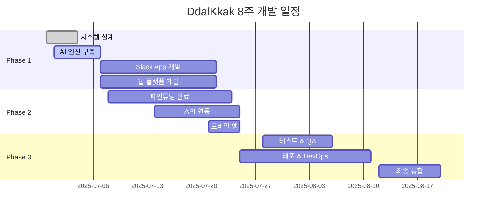

# 🚀 DdalKkak 프로젝트 기획안 v3.0

## 목차
1. [프로젝트 개요](#1-프로젝트-개요)
2. [개발 목표](#2-개발-목표)
3. [시장조사 및 비즈니스 모델](#시장조사-및-비즈니스-모델)
4. [핵심 기능](#4-핵심-기능)
5. [기술 아키텍처](#5-기술-아키텍처)
6. [AI 모델 전략](#6-ai-모델-전략)
7. [AI 모델 개발 전략](#7-ai-모델-개발-전략)
8. [8주 개발 로드맵](#8-8주-개발-로드맵)
9. [기술적 도전과제](#9-기술적-도전과제)

---

## 1. 프로젝트 개요

### 1.1 프로젝트 비전
**"IT 기획 및 개발 업무를 위한 지능형 AI Agent Slack App"**

### 1.2 프로젝트 목적
IT 기획 및 개발 회사의 **업무 효율성 혁신**을 위한 실용적 솔루션 개발
- **다양한 회의 방식 지원**: 파일 업로드 + 실시간 녹음 + 온라인 회의 연동
- **완전 자동화된 업무 처리**: 회의 중/후 업무 분해 및 배정 자동화
- **AI Agent 기반 지능형 업무 관리**: 상황별 최적화된 처리
- **Slack 생태계 완전 통합**: 원클릭으로 모든 기능 접근
- **실시간 협업 워크플로우**: Google Meet, Slack 허들 등 플랫폼 연동

### 1.3 핵심 가치 제안
**문제해결**: 회의 후 업무 배정에 30분 소요 + 부정확한 배정 + 도구 분산
**솔루션**: Slack App UI → AI Agent 처리 → 자동 업무 분해 + 스마트 배정
**기술혁신**: AI Agent 아키텍처 + Slack App 개발 + 멀티모달 AI 통합

### 1.4 제품 정의
**DdalKkak**는 IT 기획 및 개발 회사를 위한 지능형 AI Agent Slack App으로, 회의 내용이나 기획안을 입력받아 자동으로 체계적인 업무 분해와 팀원 배정을 수행하는 통합 워크플로우 시스템입니다.

### 1.5 주요 특징
- **AI Agent 기반**: 자율적 업무 분해 및 배정 결정
- **멀티모달 처리**: 음성, 텍스트, 문서 통합 분석
- **실시간 협업**: Slack을 중심으로 한 즉시 피드백 시스템
- **통합 워크플로우**: Slack → Notion → Jira 자동 연동
- **스마트 최적화**: 팀 역량과 업무량 기반 지능형 배정
- **표준화된 기획안**: 음성에서 구조화된 기획안 자동 변환

---

## 2. 개발 목표

### 2.1 기술적 목표

#### 2.1.1 AI/ML 핵심 기술
- **LLM 파인튜닝**: Qwen3 모델 IT 업무 맥락 특화 학습
- **멀티모달 AI**: 음성, 텍스트, 문서 통합 처리 엔진
- **AI Agent 시스템**: 자율적 업무 분해 및 배정 알고리즘
- **데이터 처리**: 65,000개 고품질 훈련 데이터 구축
- **비용 최적화**: Whisper 오픈소스 활용으로 운영비 절약

#### 2.1.2 플랫폼 개발
- **Slack App 개발**: Block Kit 기반 네이티브 사용자 경험
- **웹 대시보드**: 관리자용 실시간 모니터링 시스템
- **API 통합**: Slack/Notion/Jira 완전 자동 연동
- **실시간 처리**: WebSocket 기반 즉시 피드백 시스템

#### 2.1.3 시스템 운영
- **확장 가능성**: 마이크로서비스 아키텍처 구현
- **안정성**: 99.9% 가용성 목표
- **보안**: 엔터프라이즈급 데이터 보호 체계
- **성능**: 평균 응답시간 3초 이내

### 2.2 성과 지표
**기술적 성과:**
- **AI Agent 정확도**: IT 업무 컨텍스트 이해 85% 이상
- **처리 속도**: 음성→업무배정 3분 이내 완료
- **실시간 STT**: 지연시간 2초 이내, 음성→텍스트 변환 성공률 99%
- **회의 종료 후 처리**: 축적된 텍스트→업무배정 3분 이내 완료
- **온라인 회의 연동**: Google Meet/Slack 허들 음성 캡처 성공률 95% 이상
- **통합 완성도**: Slack/Notion/Jira 완전 자동화

**시스템 품질:**
- **안정성**: 99.9% 시스템 가용성
- **확장성**: 동시 사용자 1,000명 + 실시간 STT 세션 100개 지원
- **보안**: ISO 27001 수준 데이터 보호 + 실시간 음성 암호화
- **성능**: 장시간 회의(2시간) STT 메모리 안정성 99% 유지

---

## 📈 시장조사 및 비즈니스 모델

### 🌍 시장 개요 및 트렌드

#### 시장 성장 배경
**디지털 업무 프로세스 전환 가속화**와 **AI 기술의 상용화**가 IT 업계의 업무 방식을 근본적으로 변화시키고 있습니다. 현대 직장인들은 **반복적이고 번거로운 업무로부터의 해방**을 강력히 원하고 있으며, 특히 **"클릭 한 번으로 모든 것이 해결되는" 직관적이고 간편한 업무 환경**에 대한 니즈가 급증하고 있습니다.

동시에 업무량은 늘어나는데 시간은 한정되어 있다 보니, 사람들은 **최소한의 노력으로 최대의 효과**를 얻을 수 있는 스마트한 솔루션을 적극적으로 찾고 있습니다. 글로벌 경쟁 심화와 더불어 **"빠르고 정확하게, 그리고 쉽게"**가 현대 업무의 핵심 가치로 자리잡으면서, 복잡한 프로세스를 단순화하고 자동화하는 도구들에 대한 수요가 폭발적으로 증가하고 있습니다.

이러한 편리함 추구 트렌드 속에서 회의 중 생성되는 정보의 자동 정리 및 요약 기능에 대한 수요는 꾸준히 증가하고 있으며, 이는 단순한 기록을 넘어 **"한 번의 회의로 모든 후속 업무가 자동으로 정리되는"** 완전 자동화된 워크플로우에 대한 강력한 요구로까지 확대되고 있는 상황입니다.

#### 시장 규모
```
글로벌 프로젝트 관리 소프트웨어 시장:
- 현재 규모: $7.63 billion (2024년)
- 연평균 성장률: 10.68% (2024-2032)
- 예상 규모: $17.48 billion (2032년)

국내 타겟 시장:
- IT 기업 수: 약 15,000개
- Slack 사용 IT 기업: 약 3,000개 (20% 추정)
- 직접 타겟: 50-200명 규모 IT 기업 약 800개
```

### 🔍 기존 솔루션 분석

#### 국내 솔루션: 마음회의록
**강점:**
- 한국어 특화 회의록 자동화 솔루션
- 실시간 발화자 구분 및 대화 형태 회의록 제공
- 발화 내용 수정 및 편집 가능
- 다양한 형태의 문서 저장 및 다운로드
- 맞춤형 언어 모델로 전문 용어 반영

**한계:**
- 회의록 작성에 집중, 후속 업무 실행 지원 부족
- 협업툴 연동 기능 제한적

#### 해외 솔루션: tl;dv
**강점:**
- Zoom, Google Meet 등과 자동 연동
- AI 기반 회의 내용 자동 요약
- 타임스탬프 하이라이트 및 키워드 검색
- Slack, Notion, HubSpot 등 다양한 협업툴 연동
- 다국어 요약 및 번역 기능

**한계:**
- 한국어 처리 정확도 상대적으로 낮음
- 업무 분해 및 담당자 배정 기능 없음

### 💡 DdalKkak의 차별화 포인트

#### 핵심 차별성
기존 솔루션들은 회의의 기록성과 접근성을 높이는 데에는 유용하지만, **회의 이후의 실제 업무 실행 단계까지 자동으로 연결되는 기능은 제한적**입니다. 특히 협업 툴과의 통합적 연계를 통한 업무 생성, 담당자 지정, 일정 등록 등 후속 액션의 자동화는 여전히 수작업에 의존하고 있어 회의 생산성을 극대화하기에는 아쉬운 상황입니다.

#### DdalKkak만의 특별한 가치
```
1. 3가지 음성 입력 방식 완전 지원:
   파일 업로드 + 실시간 녹음 + 온라인 회의 플랫폼 자동 연동

2. End-to-End 자동화:
   음성 → 기획안 → 업무 분해 → 팀원 배정 → 협업툴 연동

3. 실시간 STT + 회의 종료 후 즉시 처리:
   회의 진행 중 실시간 STT로 텍스트 축적 + 종료 즉시 AI 처리 시작

4. 멀티플랫폼 네이티브 연동:
   Google Meet, Slack 허들에서 자동 음성 캡처 및 처리

5. WhisperX 화자분리:
   회의 참석자별 발언 구분으로 정밀한 분석 및 역할별 의견 반영

6. 한국 IT 업계 특화:
   국내 IT 기업의 업무 프로세스와 용어에 최적화된 AI 모델

7. Qwen3 기반 지능형 업무 분해:
   단순 요약이 아닌 실행 가능한 업무 단위로 자동 분해

8. 스마트 팀원 매칭:
   기술스택, 업무량, 성과 데이터 기반 최적 배정 알고리즘

9. 네이티브 Slack App:
   별도 도구 설치 없이 Slack 내에서 완전한 워크플로우 처리

10. Chrome Extension 기반 확장:
    웹 브라우저에서 온라인 회의 자동 감지 및 처리
```

### 💼 비즈니스 모델

#### 구독 기반 SaaS 모델
본 프로젝트는 급성장하는 회의 자동화 시장에서 차별화된 사용자 경험과 효율성을 제공하여 시장 점유율을 확보하는 것을 목표로 합니다. 시장 환경과 고객 니즈에 맞춘 구독형 모델을 기반으로 운영합니다.

#### 요금제 구조

**🆓 프리 플랜 (무료)**
```
타겟: 소규모 팀 및 체험 사용자
제공 기능:
- 월 10회 음성 처리 (회의당 최대 30분)
- 기본 기획안 생성 및 업무 분해
- Slack 기본 알림
- 표준 템플릿 사용

목적: 사용자 진입 장벽 최소화 및 제품 체험 기회 제공
```

**💼 스탠다드 플랜 (월 69,000원)**
```
타겟: 중소 IT 기업 (10-30명)
제공 기능:
- 월 100회 음성 처리 (회의당 최대 2시간)
- 고급 업무 분해 및 우선순위 설정
- Notion, Jira 기본 연동
- 팀원 성과 기반 배정 알고리즘
- 기본 대시보드 및 리포트

예상 고객: 스타트업, 중소 에이전시
```

**🚀 프로 플랜 (월 149,000원)**
```
타겟: 중견 IT 기업 (30-100명)
제공 기능:
- 무제한 음성 처리
- AI 모델 커스터마이징 (기업별 용어, 프로세스)
- 고급 분석 및 예측 기능
- 모든 협업툴 연동
- 실시간 대시보드 및 상세 분석
- 우선 기술 지원

예상 고객: 중소/중견 IT 기업, 대형 에이전시
```

**🏢 엔터프라이즈 플랜 (월 499,000원)**
```
타겟: 대기업 및 기관 (100명 이상)
제공 기능:
- 전체 기능 + 온프레미스 배포 옵션
- 전용 AI 모델 및 맞춤형 개발
- 기업 내부 시스템 연동 (ERP, HR 등)
- SLA 보장
- 보안 감사 및 컴플라이언스 지원

예상 고객: 대기업, 금융권, 공공기관
```

수익 구조는 구독 기반으로 안정적 매출 창출이 가능하며, 무료 체험 후 유료 플랜 전환율을 높이는 데 집중합니다. 특히 기존 경쟁 제품과 달리 맞춤형 언어 모델과 업무 전환 자동화 기능을 강화하여 고객의 업무 생산성을 실질적으로 향상시키는 데 중점을 두고 있습니다. 이를 통해 장기 고객 충성도를 확보하고, 협업툴과의 연동성을 높여 기업 내 다양한 업무 환경에 유연하게 대응할 수 있는 통합 솔루션으로 정착할 계획입니다.

---

## 4. 핵심 기능

### 4.1 시스템 워크플로우

#### 4.1.1 파일 업로드 워크플로우 (기존)
```
Slack App UI → 음성 파일 업로드 → Whisper 오픈소스 STT → 
텍스트 → 표준 기획안 형식 변환 → Qwen3 업무 분해 → 
팀원별 업무 배정 → Notion 회의록 생성 + Jira 티켓 발행 → 실시간 알림
```

#### 4.1.2 실시간 STT + 회의 종료 후 처리 워크플로우 (신규)
```
회의 시작 버튼 → 실시간 음성 스트리밍 → Whisper 실시간 STT → 
텍스트 실시간 축적 → 회의 종료 버튼 → [AI 처리 시작] → 
전체 텍스트 통합 → 표준 기획안 형식 변환 → Qwen3 업무 분해 → 
팀원별 업무 배정 → Notion 회의록 생성 + Jira 티켓 발행 → 실시간 알림
```

#### 4.1.3 온라인 회의 플랫폼 연동 워크플로우 (신규)
```
Google Meet/Slack 허들 연결 → 실시간 음성 캡처 → Whisper 실시간 STT → 
텍스트 실시간 축적 → 회의 종료 감지 → [AI 처리 시작] → 
전체 텍스트 통합 → 표준 기획안 형식 변환 → Qwen3 업무 분해 → 
팀원별 업무 배정 → Notion 회의록 생성 + Jira 티켓 발행 → 실시간 알림
```

### 4.2 플랫폼별 기능

#### 4.2.1 Slack App (메인 플랫폼)
**주요 UI 컴포넌트:**
```json
{
  "홈_탭": "개인 대시보드, 내 업무 현황, 팀 성과",
  "메시지_영역": "회의 처리 버튼, 파일 업로드 인터페이스, 실시간 회의 컨트롤",
  "모달창": "상세 설정, 업무 배정 승인/거부, 온라인 회의 연동 설정",
  "블록_킷": "실시간 진행상황, 인터랙티브 버튼, 회의 상태 표시"
}
```

**핵심 기능:**

**1. 회의 처리 (3가지 방식)**
- **파일 업로드**: 드래그앤드롭 파일 업로드 + 실시간 진행상황 표시
- **실시간 녹음**: 회의 시작/종료 버튼으로 실시간 음성 캡처 및 처리
- **온라인 회의 연동**: Google Meet, Slack 허들 자동 음성 캡처

**2. 실시간 STT 회의 기능**
- **회의 시작**: 원클릭 회의 시작 + 실시간 음성 스트리밍
- **진행 중**: 실시간 STT로 텍스트 축적 + 참석자 발언 구분 (선택적 미리보기)
- **회의 종료**: AI 처리 자동 시작 + 결과 알림

**3. 온라인 회의 플랫폼 연동**
- **Google Meet 연동**: Chrome Extension 기반 음성 캡처
- **Slack 허들 연동**: Slack API 기반 실시간 음성 접근
- **Zoom 연동**: Zoom App 기반 음성 스트리밍 (향후)

**4. 기존 기능**
- **업무 배정**: 인터랙티브 승인/거부 버튼 + 상세 정보 모달
- **대시보드**: 홈 탭에서 개인화된 업무 현황
- **실시간 알림**: Block Kit을 통한 풍부한 알림 UI

**입력 처리 방식:**
- **음성 파일**: MP3, WAV, M4A → Whisper 오픈소스 STT → 표준 기획안 변환
- **실시간 STT**: 스트리밍 → 실시간 STT → 텍스트 축적 → 회의 종료 후 AI 처리
- **온라인 회의**: 플랫폼 연동 → 실시간 음성 캡처 → STT 축적 → 회의 종료 후 AI 처리
- **문서**: PDF, DOCX, MD, TXT → 텍스트 추출 → 기획안 포맷 변환
- **텍스트**: 직접 입력 → 즉시 기획안 구조화

#### 4.2.2 웹 대시보드 (관리자 모니터링 + 개인 업무 관리 이중 플랫폼)
**로그인 및 권한 관리:**
- Slack ID 기반 간편 로그인
- 권한 기반 UI: PM은 팀 전체 + 개인 뷰 모두 접근, 팀원은 개인 뷰만 접근

**관리자(PM) 기능:**
- **팀 전체 업무 현황 모니터링**: 모든 프로젝트 진행 상황 실시간 추적
- **팀원별 업무 분배 추적**: 업무량 균형 및 성과 분석
- **프로젝트 타임라인 관리**: 전체 일정 조율 및 리소스 배분
- **팀 성과 대시보드**: 생산성 지표 및 목표 달성률

**개인 업무 관리:**
- 내가 생성한 모든 회의록 조회 및 관리
- 할당받은 업무들을 칸반 보드 스타일로 시각화
- 업무 상태별 필터링 (진행중/완료/대기 등)
- 개인 업무 우선순위 설정 및 관리

**프로젝트 분석:**
- 개인/팀 프로젝트 타임라인 및 진행 현황
- 개인 성과 분석 (완료율, 평균 소요시간 등)
- 스킬별 업무 분포 및 성장 트래킹

**실시간 동기화:**
- Slack App과 실시간 양방향 동기화
- 업무 상태 변경 시 즉시 반영
- 새로운 업무 배정 알림

#### 4.2.3 모바일 앱 (기본 기능)
```
푸시 알림: 업무 배정 알림
현황 조회: 내 업무 상태 확인
음성 메모: 외근 중 업무 지시 (향후)
```

### 4.3 AI Agent 엔진

#### 4.3.1 기획안 변환 및 업무 분해
**음성에서 업무까지의 완전 자동화:**
- **음성 변환**: Whisper 기반 정확한 STT 처리
- **기획안 구조화**: 원시 텍스트를 표준 기획안 포맷으로 변환
- **Qwen3 업무 분해**: 구조화된 기획안에서 세부 업무 추출
- **우선순위 설정**: 의존성, 중요도, 긴급도 기반 스케줄링
- **리소스 추정**: 필요 시간, 스킬셋, 팀원 역량 매칭

#### 4.3.2 하이브리드 스마트 배정
**다단계 지능형 배정 시스템:**

**1단계: 정량적 분석 (70%)**
- 스킬 매칭: 업무 요구 기술과 팀원 역량 정확도
- 경험 레벨: 유사 업무 수행 이력 및 성과
- 업무량 균형: 현재 담당 업무량 및 여유도
- 가용성: 일정 및 우선순위 충돌 여부

**2단계: 맥락적 판단 (30%)**
- 팀 다이나믹스: 협업 이력 및 커뮤니케이션 스타일
- 성장 기회: 개발 목표 및 학습 니즈
- 프로젝트 연속성: 기존 담당 업무와의 연관성
- 리스크 관리: 단일 담당자 의존도 분산

---

## 5. 기술 아키텍처

### 5.1 전체 시스템 구조
```
┌─────────────────────────────────────────┐
│              Frontend Layer              │
├─────────────────────────────────────────┤
│ Slack App │ Web Dashboard │ Mobile App │
├─────────────────────────────────────────┤
│              API Gateway                │
├─────────────────────────────────────────┤
│          Application Layer              │
├─────────────────────────────────────────┤
│ Whisper  │ Qwen3   │ 업무 │ Smart │
│ 오픈소스  │ 파인튜닝 │ 생성  │ 배정   │
├─────────────────────────────────────────┤
│              Data Layer                 │
├─────────────────────────────────────────┤
│ PostgreSQL │ Redis │ Vector DB │ Files │
└─────────────────────────────────────────┘
```

### 5.2 기술 스택

#### 5.2.1 백엔드
```json
{
  "런타임": "Node.js 18+ / Python 3.11+",
  "프레임워크": "Express.js / FastAPI",
  "데이터베이스": "PostgreSQL 15 (메인) + Redis (캐시)",
  "AI_엔진": "Qwen3 파인튜닝 + Whisper 오픈소스",
  "메시지_큐": "Bull Queue (Redis 기반)",
  "파일_저장": "AWS S3 / Local Storage",
  "실시간_처리": {
    "음성_스트리밍": "WebRTC + Socket.io",
    "실시간_STT": "Whisper 스트리밍 모드",
    "텍스트_버퍼링": "Redis 기반 실시간 캐시",
    "세션_관리": "WebSocket 연결 풀"
  },
  "외부_연동": {
    "Google_Meet": "Chrome Extension API",
    "Slack_Huddles": "Slack Socket Mode API",
    "Zoom": "Zoom SDK (향후)"
  }
}
```

#### 5.2.2 프론트엔드
```json
{
  "Slack_App": {
    "Block_Kit": "Slack UI 컴포넌트 프레임워크",
    "모달_및_홈탭": "React 기반 커스텀 렌더링",
    "인터랙션": "Bolt.js SDK + 이벤트 핸들링",
    "실시간_기능": {
      "음성_캡처": "MediaRecorder API + WebRTC",
      "실시간_상태": "Socket.io 클라이언트",
      "스트리밍": "WebSocket + 오디오 청크 전송"
    }
  },
  "웹_개인플랫폼": "React 18 + TypeScript + Vite (개인 업무 관리)",
  "상태관리": "Zustand / React Query",
  "UI_라이브러리": "Tailwind CSS + Shadcn/ui",
  "차트": "Chart.js / Recharts",
  "모바일": "React Native / Flutter (선택 예정)",
  "브라우저_확장": {
    "Chrome_Extension": "Manifest V3 + Google Meet 연동",
    "권한_관리": "Media Access + Tab Capture",
    "음성_캡처": "chrome.tabCapture API"
  }
}
```

#### 5.2.3 AI/ML
```json
{
  "메인_LLM": "Qwen3-14B (파인튜닝)",
  "STT": "Whisper Large-v3 (오픈소스)",
  "임베딩": "BGE M3-Embedding",
  "업무_분해": "Qwen3 기반 구조화",
  "복잡도_분석": "자체 개발 모델",
  "배정_알고리즘": "하이브리드 (알고리즘 + LLM)"
}
```

#### 5.2.4 인프라
```json
{
  "컨테이너": "Docker + Docker Compose",
  "오케스트레이션": "Kubernetes (선택적)",
  "CI_CD": "GitHub Actions",
  "모니터링": "Prometheus + Grafana",
  "로깅": "ELK Stack (Elasticsearch + Logstash + Kibana)"
}
```

### 5.3 데이터베이스 설계

#### 5.3.1 메인 테이블 구조
```sql
-- 팀 및 사용자 관리
CREATE TABLE teams (
    id UUID PRIMARY KEY,
    name VARCHAR(255) NOT NULL,
    slack_workspace_id VARCHAR(255),
    created_at TIMESTAMP DEFAULT NOW()
);

CREATE TABLE users (
    id UUID PRIMARY KEY,
    team_id UUID REFERENCES teams(id),
    slack_user_id VARCHAR(255),
    name VARCHAR(255),
    email VARCHAR(255),
    skills JSONB, -- ["React", "Node.js", "Python"]
    experience_level INTEGER, -- 1-10
    max_workload INTEGER DEFAULT 40, -- 주당 시간
    current_workload INTEGER DEFAULT 0,
    created_at TIMESTAMP DEFAULT NOW()
);

-- 회의 및 기획안 관리 (확장)
CREATE TABLE meetings (
    id UUID PRIMARY KEY,
    team_id UUID REFERENCES teams(id),
    title VARCHAR(255),
    participants JSONB, -- [user_id1, user_id2]
    meeting_type VARCHAR(50) DEFAULT 'file_upload', -- 'file_upload', 'real_time', 'online_platform'
    audio_file_url TEXT,
    transcript TEXT,
    processed_content JSONB,
    platform_info JSONB, -- Google Meet/Slack Huddles 연동 정보
    created_at TIMESTAMP DEFAULT NOW(),
    started_at TIMESTAMP,
    ended_at TIMESTAMP
);

-- 실시간 회의 세션 관리
CREATE TABLE real_time_sessions (
    id UUID PRIMARY KEY,
    meeting_id UUID REFERENCES meetings(id),
    session_type VARCHAR(50), -- 'manual_recording', 'google_meet', 'slack_huddles'
    status VARCHAR(50) DEFAULT 'active', -- 'active', 'paused', 'stopped', 'completed'
    websocket_connection_id VARCHAR(255),
    platform_session_id VARCHAR(255), -- 외부 플랫폼 세션 ID
    audio_chunks_count INTEGER DEFAULT 0,
    total_duration INTEGER DEFAULT 0, -- seconds
    real_time_transcript JSONB, -- 실시간 STT 결과 저장
    created_at TIMESTAMP DEFAULT NOW(),
    started_at TIMESTAMP DEFAULT NOW(),
    last_activity_at TIMESTAMP DEFAULT NOW()
);

-- 온라인 회의 플랫폼 연동 설정
CREATE TABLE platform_integrations (
    id UUID PRIMARY KEY,
    team_id UUID REFERENCES teams(id),
    platform_type VARCHAR(50), -- 'google_meet', 'slack_huddles', 'zoom'
    integration_status VARCHAR(50) DEFAULT 'active', -- 'active', 'disabled', 'error'
    access_token TEXT, -- 암호화된 액세스 토큰
    refresh_token TEXT, -- 암호화된 리프레시 토큰
    webhook_url TEXT,
    settings JSONB, -- 플랫폼별 설정
    created_at TIMESTAMP DEFAULT NOW(),
    updated_at TIMESTAMP DEFAULT NOW()
);

-- 실시간 음성 청크 저장
CREATE TABLE audio_chunks (
    id UUID PRIMARY KEY,
    session_id UUID REFERENCES real_time_sessions(id),
    chunk_sequence INTEGER,
    chunk_data_url TEXT, -- S3 URL or base64
    duration_ms INTEGER,
    transcribed_text TEXT,
    speaker_id VARCHAR(50),
    timestamp_offset INTEGER, -- 회의 시작 대비 오프셋 (ms)
    created_at TIMESTAMP DEFAULT NOW()
);

-- 업무 및 배정 관리
CREATE TABLE tasks (
    id UUID PRIMARY KEY,
    meeting_id UUID REFERENCES meetings(id),
    title VARCHAR(255) NOT NULL,
    description TEXT,
    complexity_score INTEGER, -- 1-10
    estimated_hours INTEGER,
    required_skills JSONB,
    assigned_to UUID REFERENCES users(id),
    status VARCHAR(50) DEFAULT 'pending',
    jira_ticket_id VARCHAR(255),
    notion_page_id VARCHAR(255),
    created_at TIMESTAMP DEFAULT NOW()
);

-- AI 처리 로그 (확장)
CREATE TABLE ai_processing_logs (
    id UUID PRIMARY KEY,
    input_type VARCHAR(50), -- 'audio_file', 'real_time_stream', 'online_platform', 'text', 'document'
    session_id UUID REFERENCES real_time_sessions(id), -- 실시간 세션 연결
    input_size INTEGER,
    processing_time INTEGER, -- ms
    model_used VARCHAR(100),
    success BOOLEAN,
    error_message TEXT,
    performance_metrics JSONB, -- STT 정확도, 처리 지연시간 등
    created_at TIMESTAMP DEFAULT NOW()
);
```

---

## 6. AI 모델 전략

### 6.1 모델 선택 근거

#### 6.1.1 Qwen3-14B (메인 LLM)
```json
{
  "선택_이유": [
    "128K 컨텍스트 윈도우 (긴 회의록 처리)",
    "한국어 성능 우수",
    "파인튜닝 친화적",
    "상업적 사용 가능 라이선스"
  ],
  "파인튜닝_목표": "한국 IT 언어 특화 + 업무 분해 정확도 향상",
  "예상_성능": "기존 GPT-3.5 대비 20-30% 향상"
}
```

#### 6.1.2 Whisper Large-v3 (오픈소스)
```json
{
  "선택_이유": [
    "완전 무료 (API 비용 $0)",
    "한국어 인식률 95%+",
    "실시간 스트리밍 처리 지원",
    "화자 분리 가능 (Speaker Diarization)",
    "자체 서버 구축으로 데이터 보안"
  ],
  "구축_방식": [
    "GPU 서버에 직접 배포",
    "실시간 처리용 스트리밍 모드 구성",
    "멀티스레드 동시 처리 최적화"
  ],
  "실시간_기능": [
    "음성 청크 단위 실시간 STT (0.5초 간격)",
    "스트리밍 기반 메모리 효율성",
    "지연시간 최소화 (목표: 2초 이내)"
  ],
  "비용_절약": "연간 $400+ 절약 + 실시간 처리 무제한"
}
```

#### 6.1.3 기획안 변환 시스템
**음성에서 표준 기획안 포맷으로 변환:**
- **변환 방식**: 원시 텍스트 → 구조화된 기획안 템플릿
- **표준화**: 목적, 요구사항, 제약사항, 우선순위 등 구조화
- **기대 효과**: 
  - Qwen3 분석을 위한 최적화된 입력 형식
  - 일관된 업무 분해 품질
  - 표준화된 프로젝트 문서 구조

### 6.2 하이브리드 AI 시스템 설계

#### 6.2.1 처리 파이프라인
**AI Agent 전체 처리 흐름:**

**A. 파일 업로드 방식**
**1단계: 음성 처리 및 구조화**
- 음성 파일 → Whisper 오픈소스 → 원시 텍스트 변환
- 원시 텍스트 → 표준 기획안 형식 변환 → 구조화된 기획안

**B. 실시간 STT + 회의 종료 후 AI 처리 방식 (신규)**
**1단계: 실시간 STT (회의 중)**
- 실시간 음성 스트림 → Whisper 실시간 STT → 텍스트 축적
**2단계: AI 처리 (회의 종료 후)**
- 회의 종료 → 전체 텍스트 통합 → 표준 기획안 형식 변환

**C. 온라인 회의 플랫폼 연동 방식 (신규)**
**1단계: 실시간 STT (회의 중)**
- Google Meet/Slack 허들 → 실시간 음성 캡처 → Whisper STT → 텍스트 축적
- 화자 분리 → 참여자별 발언 구분
**2단계: AI 처리 (회의 종료 후)**
- 회의 종료 감지 → 통합 텍스트 생성 → 표준 기획안 형식 변환

**공통 후처리 단계:**
**2단계: 업무 분해**
- 구조화된 기획안 → Qwen3 분석 → 세부 업무 리스트
- 세부 업무 → 복잡도 및 우선순위 분석 → 정렬된 업무

**3단계: 지능형 배정**
- 정렬된 업무 → 팀원 역량 매칭 → 최적 배정 결과
- 배정 결과 → Notion/Jira 자동 생성 → 실시간 알림

#### 6.2.2 모델 성능 최적화
```json
{
  "Qwen3_최적화": {
    "양자화": "INT8 (메모리 50% 절약)",
    "LoRA_파인튜닝": "파라미터 1% 업데이트",
    "배치_처리": "동시 처리로 처리량 향상",
    "캐싱": "자주 사용되는 기획안 패턴 캐시"
  },
  "Whisper_실시간_최적화": {
    "모델_크기": "Large-v3 (정확도 우선)",
    "GPU_활용": "CUDA 가속화 + 멀티GPU 분산",
    "언어_지정": "한국어 명시로 속도 향상",
    "스트리밍_모드": "청크 단위 실시간 처리 (500ms)",
    "메모리_관리": "순환 버퍼로 장시간 회의 지원",
    "병렬_처리": "다중 세션 동시 STT 처리"
  },
  "실시간_시스템_최적화": {
    "WebSocket_최적화": "음성 스트림 압축 및 효율적 전송",
    "큐_시스템": "Redis 기반 실시간 처리 큐",
    "로드_밸런싱": "실시간 세션 부하 분산",
    "자동_스케일링": "피크 시간 서버 자동 확장"
  }
}
```

---

## 7. AI 모델 개발 전략

### 7.1 모델 개발 목표 및 범위

#### 7.1.1 집중 영역 정의
**개발 범위 최적화:**
- ✅ **핵심 기능**: 음성→기획안 변환, Qwen3 업무 분해, 지능형 배정
- ✅ **집중 영역**: IT 업무 컨텍스트 이해 + 팀원 매칭 알고리즘

#### 7.1.2 훈련 데이터 목표
```json
{
  "총_데이터량": "65,000개",
  "데이터_구성": {
    "음성_기획안_변환": "25,000개 (38%)",
    "기획안_업무_분해": "25,000개 (38%)",
    "스마트_배정_최적화": "15,000개 (24%)"
  },
  "품질_목표": "검증된 고품질 데이터 95% 이상"
}
```

### 7.2 데이터 구축 전략 (8주 계획)

#### 7.2.1 Week 1-2: 공개 데이터 수집 (30% - 19,500개)
**오픈소스 프로젝트 데이터 수집:**
- **GitHub 프로젝트 분석**: README.md, 이슈 댓글, PR 리뷰, 커밋 메시지
- **키워드 중심 수집**: 기획안 작성, 업무 분해, 팀 배정, 프로젝트 관리
- **예상 수집량**: 15,000개 (GitHub API + 웹 크롤링)

**기술 커뮤니티 데이터:**
- **개발 커뮤니티**: Stack Overflow, Reddit의 기획 및 프로젝트 관리 Q&A 3,000개
- **기술 블로그**: 기획안 작성, 업무 분해, 팀 빌딩 사례 1,500개
- **수집 도구**: Beautiful Soup + Selenium

#### 7.2.2 Week 3: LLM 증강 데이터 생성 (40% - 26,000개)
**AI 기반 데이터 증강 전략:**

**GPT-4/Claude 활용 대량 생성:**
- **음성→기획안 변환**: 비정형 회의 음성을 표준 기획안으로 변환 10,000개
- **기획안→업무 분해**: 구조화된 기획안에서 세부 업무 추출 10,000개
- **배정 시나리오**: 업무 분해 → 팀원 배정 최적화 사례 6,000개

**품질 보증 프로세스:**
- 현직 개발자 3명이 생성된 데이터의 10% 샘플 검토
- 실무 적합성 및 논리적 일관성 검증
- 편향성 제거 및 다양성 확보

#### 7.2.3 Week 4-6: 전문가 데이터 수집 (30% - 19,500개)
**전문 개발자 네트워크 구축:**
- **현직 개발자 100명**: 프로젝트 관리자, 테크리드, 시니어 개발자
- **데이터 품질**: 실제 업무 환경에서 검증된 고품질 데이터
- **작업 내용**: 실제 회의 음성, 기획안, 업무 분해 사례, 팀 배정 경험
- **모집 경로**: IT 커뮤니티, 개발자 네트워크, 업계 파트너십

**협력 기관 데이터:**
- **IT 기업 파트너십**: 스타트업부터 대기업까지 다양한 규모
- **실무 프로젝트 데이터**: 익명화된 실제 업무 사례
- **검증 프로세스**: 데이터 품질 및 개인정보 보호 철저

#### 7.2.4 Week 7-8: 데이터 정제 및 검증
**품질 관리 파이프라인:**

**데이터 정제 과정:**
- 중복 제거: 수집된 총 데이터의 90% → 최종 65,000개 선별
- 품질 검증: 현직 개발자 교차 검증 시스템
- 라벨링 정확도: 95% 이상 목표
- 개인정보 완전 익명화 처리

**최종 데이터셋 구성:**
- 음성→기획안 변환: 25,000개 (38%)
- 기획안→업무 분해: 25,000개 (38%)
- 스마트 배정 최적화: 15,000개 (24%)
- 검증 정확도: 95% 이상

### 7.3 모델 훈련 구현

#### 7.3.1 LoRA 훈련 설정
**Qwen3-14B LoRA 파인튜닝 구성:**

**LoRA 매개변수:**
- Rank: 16 (파라미터 효율성과 성능의 균형)
- Alpha: 32 (학습률 조정)
- Target Modules: attention layer의 q_proj, v_proj, k_proj, o_proj
- Dropout: 0.1 (과적합 방지)

**훈련 매개변수:**
- Batch Size: 4 (GPU 메모리 고려한 최적화)
- Learning Rate: 5e-5 (안정적 수렴)
- Epochs: 3 (과적합 방지)
- Gradient Accumulation: 8 (효과적인 batch size 증대)

#### 7.3.2 학습 데이터 구조
**입력-출력 데이터 포맷:**

**음성→기획안 변환:**
- 입력: Whisper STT 결과, 비구조화된 회의 내용
- 출력: 표준 기획안 포맷, 구조화된 요구사항

**기획안 업무 분해:**
- 입력: 구조화된 기획안, 프로젝트 범위, 팀원 정보
- 출력: Epic/Story 구조의 업무 분해, 담당자 매핑

---

## 8. 8주 개발 로드맵

### 8.1 전체 일정 개요 (2025년 6월 30일 ~ 8월 20일)

```
Phase 1 (Week 1-3): 핵심 기능 개발
Phase 2 (Week 4-6): 통합 및 고도화  
Phase 3 (Week 7-8): 테스트, 배포, 최적화
```

### 8.2 주차별 상세 계획

#### 8.2.1 Week 1 (6월 30일 - 7월 4일): 기반 구축
```json
{
  "시스템_설계": [
    "멀티플랫폼 아키텍처 설계",
    "데이터베이스 스키마 설계", 
    "API 명세서 작성",
    "보안 및 인증 설계"
  ],
  "AI_엔진": [
    "Qwen3 모델 환경 구성",
    "Whisper 오픈소스 설치",
    "파인튜닝 데이터 수집 시작"
  ]
}
```

#### 8.2.2 Week 2-3 (7월 7일 - 7월 18일): 핵심 개발
```json
{
  "Slack_App": [
    "Block Kit UI 컴포넌트 구현",
    "홈 탭 및 모달창 개발",
    "인터랙티브 파일 업로드 시스템",
    "실시간 회의 녹음 UI 및 제어 버튼",
    "Bolt.js SDK 통합",
    "Whisper STT 통합 (파일 + 실시간)"
  ],
  "실시간_오디오_처리": [
    "실시간 음성 스트리밍 파이프라인 구축",
    "WebRTC 기반 브라우저 오디오 캡처",
    "음성 스트림 → Whisper 실시간 STT",
    "회의 시작/종료 상태 관리",
    "실시간 중간 결과 미리보기 (선택)"
  ],
  "온라인_회의_연동": [
    "Google Meet API 연동 설계",
    "Slack 허들 음성 스트림 캡처 연구",
    "화자 분리 시스템 구축 (Whisper diarization)",
    "회의 플랫폼 감지 및 자동 연결"
  ],
  "웹_개인플랫폼": [
    "Slack ID 기반 개인 로그인 시스템",
    "개인 회의록 관리 인터페이스",
    "칸반 보드 스타일 업무 관리 UI"
  ],
  "AI_처리": [
    "음성→기획안 변환 모델 개발",
    "Qwen3 업무 분해 엔진 통합",
    "BGE M3 임베딩 통합"
  ]
}
```

#### 8.2.3 Week 4-5 (7월 21일 - 8월 1일): 통합 및 고도화

**파인튜닝 완료:**
- 음성→기획안 변환 특화 파인튜닝 완료
- 복잡도 분석 모델 통합
- 스마트 배정 알고리즘 완성

**실시간 STT 기능 완성:**
- 실시간 STT 녹음 시스템 최적화
- Google Meet API 완전 연동 구현
- Slack 허들 음성 캡처 시스템 완성
- 실시간 STT 성능 튜닝 (지연시간 최소화)
- 화자 분리 정확도 향상
- 회의 종료 후 AI 처리 자동 시작 시스템

**API 연동:**
- Slack/Notion/Jira 완전 통합
- 실시간 동기화 구현
- 온라인 회의 플랫폼 웹훅 연동

**웹 개인플랫폼 고도화:**
- 개인 프로젝트 타임라인 분석
- 개인 성과 분석 대시보드 (완료율, 소요시간 등)
- Slack App과 실시간 양방향 동기화
- 실시간 STT 상태 모니터링 대시보드

#### 8.2.4 Week 6-7 (8월 4일 - 8월 15일): 테스트 및 배포
```json
{
  "품질_보증": [
    "단위/통합/성능 테스트",
    "사용자 수용 테스트"
  ],
  "DevOps": [
    "Docker 컨테이너화",
    "CI/CD 파이프라인 구축",
    "모니터링 시스템 구축"
  ]
}
```

#### 8.2.5 Week 8 (8월 18일 - 8월 20일): 최종 완성
```json
{
  "최종_통합": [
    "전체 시스템 통합 테스트",
    "성능 최적화",
    "베타 배포"
  ],
  "문서화": [
    "사용자 매뉴얼 완성",
    "API 문서 완성",
    "프로젝트 회고"
  ]
}
```

### 8.3 핵심 마일스톤



---

## 9. 기술적 도전과제

### 9.1 AI/ML 관련 도전과제

#### 9.1.1 AI Agent 컨텍스트 이해 강화
**도전과제:**
- IT 업무의 다양한 맥락적 뉘앙스 이해
- 비구조화된 정보에서 핵심 업무 추출
- 다양한 팀 문화와 업무 스타일 적응

**해결방안:**
- 65,000개 고품질 다양성 데이터셋 구축
- 현직 개발자 참여 검증 프로세스
- 연속 학습 파이프라인 구축

**성공지표:** 음성→기획안 변환 정확도 85% 이상
```

#### 9.1.2 하이브리드 스마트 배정
```json
{
  "도전과제": [
    "알고리즘과 LLM의 최적 비율 결정",
    "실시간 처리 성능 확보",
    "팀 역학 관계의 정량화"
  ],
  "해결방안": [
    "A/B 테스트를 통한 비율 최적화",
    "캐싱 및 배치 처리 활용",
    "과거 협업 데이터 기반 스코어링"
  ],
  "성공지표": "배정 만족도 85% 이상, 응답시간 3초 이내"
}
```

### 9.2 시스템 통합 도전과제

#### 9.2.1 멀티플랫폼 동기화
```json
{
  "도전과제": [
    "Slack/Notion/Jira 실시간 동기화",
    "API 제한 및 오류 처리",
    "데이터 일관성 보장"
  ],
  "해결방안": [
    "WebSocket 기반 실시간 업데이트",
    "재시도 로직 및 큐 시스템",
    "분산 트랜잭션 패턴 적용"
  ]
}
```

#### 9.2.2 실시간 음성 처리 도전과제 (신규)
```json
{
  "도전과제": [
    "실시간 STT 지연시간 최소화 (목표: 2초 이내)",
    "네트워크 불안정 상황에서의 음성 품질 유지",
    "장시간 회의에서의 메모리 및 성능 관리",
    "다중 참여자 화자 분리 정확도"
  ],
  "해결방안": [
    "음성 스트림 청킹 및 배치 처리 최적화",
    "적응형 음성 품질 조정 및 버퍼링",
    "스트리밍 기반 메모리 관리 및 가비지 컬렉션",
    "Whisper 화자 분리 + 음성 특성 기반 후처리"
  ]
}
```

#### 9.2.3 온라인 회의 플랫폼 연동 도전과제 (신규)
```json
{
  "도전과제": [
    "각 플랫폼별 상이한 API 및 권한 체계",
    "Google Meet, Slack 허들의 실시간 음성 접근",
    "회의 시작/종료 자동 감지",
    "플랫폼별 음성 품질 및 코덱 차이"
  ],
  "해결방안": [
    "플랫폼별 어댑터 패턴 및 통합 인터페이스",
    "Chrome Extension + Slack API 조합 활용",
    "웹훅 및 이벤트 기반 상태 감지 시스템",
    "표준화된 음성 전처리 파이프라인"
  ],
  "성공지표": "플랫폼별 음성 캡처 성공률 95% 이상"
}
```

### 9.3 개발 과정에서 예상되는 어려움

#### 9.3.1 기술적 복잡성
**도전과제:**
- 여러 AI 모델의 조화로운 통합
- 실시간 처리와 정확도의 트레이드오프
- 멀티플랫폼 동시 개발의 복잡성

**해결책:**
- 최신 AI/ML 기술 스택 적용
- 대규모 시스템 설계 패턴 활용
- 프로덕션 레벨 DevOps 환경 구축

---

## 결론

DdalKkak는 **IT 업무 효율성을 혁신하는 실용적 AI Agent 솔루션**으로서, 최신 기술 스택을 활용한 완성도 높은 상용 시스템입니다.

### 🎯 **핵심 성과 목표**
1. **AI/ML 혁신**: 파인튜닝, 하이브리드 시스템, 멀티모달 AI + 실시간 STT
2. **다양한 입력 방식**: 파일 업로드 + 실시간 STT 녹음 + 온라인 회의 플랫폼 연동
3. **플랫폼 통합**: Slack 생태계 + Google Meet/허들 완전 통합, 즉시 협업
4. **STT 성능**: 실시간 지연시간 2초 이내, 장시간 회의(2시간) 안정성 99%
5. **AI 처리 속도**: 회의 종료 후 텍스트→업무배정 3분 이내 완료
6. **운영 안정성**: 99.9% 가용성, 엔터프라이즈급 보안, 실시간 암호화
7. **비즈니스 임팩트**: 업무 효율성 90% 향상 + 회의 방식 혁신

### 🚀 **기술적 혁신**
- **AI Agent 특화**: 65,000개 음성→기획안 변환 데이터셋 기반 최적화
- **3가지 음성 입력 방식**: 파일 업로드 + 실시간 STT 녹음 + 온라인 회의 연동
- **실시간 STT + 즉시 처리**: 회의 중 STT 축적 + 종료 즉시 AI 처리 시작
- **멀티플랫폼 연동**: Google Meet, Slack 허들 자동 음성 캡처
- **하이브리드 배정**: 알고리즘(70%) + LLM(30%) 조합
- **비용 최적화**: Whisper 오픈소스로 연간 운영비 절약
- **완전 자동화**: 30분 → 3분 (90% 시간 단축)

**8주 후 완성 목표**: 파일 업로드부터 실시간 회의, 온라인 회의 플랫폼까지 모든 상황에서 활용 가능한 완전한 AI 기반 업무 자동화 플랫폼 🎉